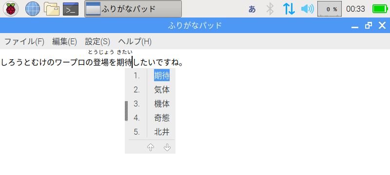
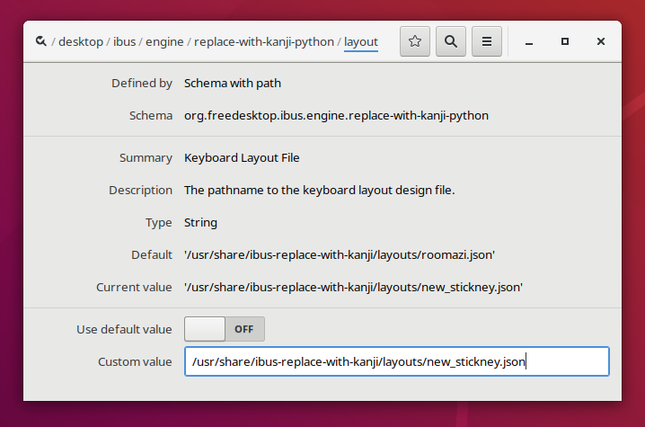

# ひらがなIME for IBus<br>&mdash; <ruby>日本語<rp>(</rp><rt>にほんご</rt><rp>)</rp></ruby> <ruby>漢字<rp>(</rp><rt>かんじ</rt><rp>)</rp></ruby><ruby>置換<rp>(</rp><rt>ちかん</rt><rp>)</rp></ruby>インプット メソッド &mdash;

　「ひらがなIME」は、かながきする<ruby>部分<rp>(</rp><rt>ぶぶん</rt><rp>)</rp></ruby>のおおくなった<ruby>日本語<rp>(</rp><rt>にほんご</rt><rp>)</rp></ruby>を<ruby>入力<rp>(</rp><rt>にゅうりょく</rt><rp>)</rp></ruby>しやすくした<ruby>日本語<rp>(</rp><rt>にほんご</rt><rp>)</rp></ruby>インプット メソッドです。
Fedora、Ubuntu、Raspberry Pi<ruby>用<rp>(</rp><rt>よう</rt><rp>)</rp></ruby>のRaspbianなど、[IBus](https://github.com/ibus/ibus/wiki)に<ruby>対応<rp>(</rp><rt>たいおう</rt><rp>)</rp></ruby>したオペレーティング システム（OS）で<ruby>利用<rp>(</rp><rt>りよう</rt><rp>)</rp></ruby>できます。

　これまでの<ruby>日本語<rp>(</rp><rt>にほんご</rt><rp>)</rp></ruby>IMEとちがって、「ひらがなIME」には「よみの<ruby>入力<rp>(</rp><rt>にゅうりょく</rt><rp>)</rp></ruby>モード」がありません。
ですから、ひらがなを<ruby>入力<rp>(</rp><rt>にゅうりょく</rt><rp>)</rp></ruby>するのに、いちいち〔<ruby>確定<rp>(</rp><rt>かくてい</rt><rp>)</rp></ruby>〕キーや〔<ruby>無変換<rp>(</rp><rt>むへんかん</rt><rp>)</rp></ruby>〕キーなどをおす<ruby>必要<rp>(</rp><rt>ひつよう</rt><rp>)</rp></ruby>がありません。
<ruby>文中<rp>(</rp><rt>ぶんちゅう</rt><rp>)</rp></ruby>のひらがなの<ruby>部分<rp>(</rp><rt>ぶぶん</rt><rp>)</rp></ruby>は、あとから、いつでも<ruby>漢字<rp>(</rp><rt>かんじ</rt><rp>)</rp></ruby>におきかえることができます。

#### 「ひらがなIME」に<ruby>対応<rp>(</rp><rt>たいおう</rt><rp>)</rp></ruby>しているアプリケーション ソフトウェア

　「ひらがなIME」は、IBusの[<ruby>周辺<rp>(</rp><rt>しゅうへん</rt><rp>)</rp></ruby>テキストAPI](http://ibus.github.io/docs/ibus-1.5/IBusEngine.html#ibus-engine-get-surrounding-text)を<ruby>応用<rp>(</rp><rt>おうよう</rt><rp>)</rp></ruby>した、あたらしい<ruby>入力<rp>(</rp><rt>にゅうりょく</rt><rp>)</rp></ruby><ruby>方式<rp>(</rp><rt>ほうしき</rt><rp>)</rp></ruby>です。
GNOMEの<ruby>標準<rp>(</rp><rt>ひょうじゅん</rt><rp>)</rp></ruby>のテキスト エディターgeditや「[ふりがなパッド](https://github.com/esrille/furiganapad)」は<ruby>周辺<rp>(</rp><rt>しゅうへん</rt><rp>)</rp></ruby>テキストAPIに<ruby>対応<rp>(</rp><rt>たいおう</rt><rp>)</rp></ruby>しています。
また、LibreOffice Writerも<ruby>最新版<rp>(</rp><rt>さいしんばん</rt><rp>)</rp></ruby>などは<ruby>周辺<rp>(</rp><rt>しゅうへん</rt><rp>)</rp></ruby>テキストAPIに<ruby>対応<rp>(</rp><rt>たいおう</rt><rp>)</rp></ruby>しています。

　けれども、<ruby>周辺<rp>(</rp><rt>しゅうへん</rt><rp>)</rp></ruby>テキストAPIにまだ<ruby>対応<rp>(</rp><rt>たいおう</rt><rp>)</rp></ruby>できていないアプリケーション ソフトウェアもあります。
そのようなソフトでは、<ruby>直前<rp>(</rp><rt>ちょくぜん</rt><rp>)</rp></ruby>に<ruby>入力<rp>(</rp><rt>にゅうりょく</rt><rp>)</rp></ruby>した<ruby>文字列<rp>(</rp><rt>もじれつ</rt><rp>)</rp></ruby>だけを<ruby>漢字<rp>(</rp><rt>かんじ</rt><rp>)</rp></ruby>に<ruby>変換<rp>(</rp><rt>へんかん</rt><rp>)</rp></ruby>できます（カーソルを<ruby>移動<rp>(</rp><rt>いどう</rt><rp>)</rp></ruby>してあとから<ruby>漢字<rp>(</rp><rt>かんじ</rt><rp>)</rp></ruby>に<ruby>変換<rp>(</rp><rt>へんかん</rt><rp>)</rp></ruby>したりすることはできません）。

## 「ひらがなIME」のインストール<ruby>方法<rp>(</rp><rt>ほうほう</rt><rp>)</rp></ruby>
　つかっているOSが、Fedora, Ubuntu, Raspbianのどれかであれば、インストール<ruby>用<rp>(</rp><rt>よう</rt><rp>)</rp></ruby>のソフトウェア パッケージを「[Releases](https://github.com/esrille/ibus-replace-with-kanji/releases)」ページからダウンロードできます。

　インストールができたら、「IBusの<ruby>設定<rp>(</rp><rt>せってい</rt><rp>)</rp></ruby>(IBus Preferences)」の「<ruby>入力<rp>(</rp><rt>にゅうりょく</rt><rp>)</rp></ruby>メソッド(Input Method)」タブで、

 <ruby>日本語<rp>(</rp><rt>にほんご</rt><rp>)</rp></ruby>(Japanese) - ReplaceWithKanji

を<ruby>選択<rp>(</rp><rt>せんたく</rt><rp>)</rp></ruby>してください。

※ 「ひらがなIME」をじぶんでビルドしてインストールしたいときは、つぎの<ruby>手順<rp>(</rp><rt>てじゅん</rt><rp>)</rp></ruby>でインストールできます。
```
$ ./autogen.sh
$ make
$ sudo make install
$ ibus restart
```

## <ruby>基本的<rp>(</rp><rt>きほんてき</rt><rp>)</rp></ruby>なつかいかた



### <ruby>入力<rp>(</rp><rt>にゅうりょく</rt><rp>)</rp></ruby>モード

　「ひらがなIME」には、３つの<ruby>入力<rp>(</rp><rt>にゅうりょく</rt><rp>)</rp></ruby>モードがあります。
<ruby>現在<rp>(</rp><rt>げんざい</rt><rp>)</rp></ruby>の<ruby>入力<rp>(</rp><rt>にゅうりょく</rt><rp>)</rp></ruby>モードは、<ruby>画面<rp>(</rp><rt>がめん</rt><rp>)</rp></ruby>うえがわのトップバーのなかに<ruby>表示<rp>(</rp><rt>ひょうじ</rt><rp>)</rp></ruby>されます。
ふだんよくつかうのは、「ひらがなモード」と「<ruby>英<rp>(</rp><rt>えい</rt><rp>)</rp></ruby><ruby>数<rp>(</rp><rt>すう</rt><rp>)</rp></ruby>モード」です。

<ruby>入力<rp>(</rp><rt>にゅうりょく</rt><rp>)</rp></ruby>モードの<ruby>表示<rp>(</rp><rt>ひょうじ</rt><rp>)</rp></ruby> | モードのなまえ | <ruby>解説<rp>(</rp><rt>かいせつ</rt><rp>)</rp></ruby>
---|---|---
あ | ひらがなモード | ひらがなを<ruby>入力<rp>(</rp><rt>にゅうりょく</rt><rp>)</rp></ruby>するモードです。<br>※ かな<ruby>漢字<rp>(</rp><rt>かんじ</rt><rp>)</rp></ruby>まじり<ruby>文<rp>(</rp><rt>ぶん</rt><rp>)</rp></ruby>を<ruby>入力<rp>(</rp><rt>にゅうりょく</rt><rp>)</rp></ruby>するときは、このモードにします。
A | <ruby>英<rp>(</rp><rt>えい</rt><rp>)</rp></ruby><ruby>数<rp>(</rp><rt>すう</rt><rp>)</rp></ruby>モード | アルファベットや<ruby>数字<rp>(</rp><rt>すうじ</rt><rp>)</rp></ruby>を<ruby>入力<rp>(</rp><rt>にゅうりょく</rt><rp>)</rp></ruby>するモードです。
ア | カタカナ モード | ちょくせつカタカナを<ruby>入力<rp>(</rp><rt>にゅうりょく</rt><rp>)</rp></ruby>するモードです。

### <ruby>漢語<rp>(</rp><rt>かんご</rt><rp>)</rp></ruby>やカタカナのことばの<ruby>入力<rp>(</rp><rt>にゅうりょく</rt><rp>)</rp></ruby>

　たとえば、「しろうとむけのワープロの<ruby>登場<rp>(</rp><rt>とうじょう</rt><rp>)</rp></ruby>を<ruby>期待<rp>(</rp><rt>きたい</rt><rp>)</rp></ruby>したいですね。」という<ruby>文<rp>(</rp><rt>ぶん</rt><rp>)</rp></ruby>を<ruby>入力<rp>(</rp><rt>にゅうりょく</rt><rp>)</rp></ruby>するには、つぎのようにキーボードをうちます。
```
しろうとむけのわーぷろ〔変換〕のとうじょう〔変換〕をきたい〔変換〕したいですね。
```
　<ruby>漢字<rp>(</rp><rt>かんじ</rt><rp>)</rp></ruby>やカタカナの<ruby>部分<rp>(</rp><rt>ぶぶん</rt><rp>)</rp></ruby>は、まずはひらがなで<ruby>入力<rp>(</rp><rt>にゅうりょく</rt><rp>)</rp></ruby>します。
そのあとで、〔<ruby>変換<rp>(</rp><rt>へんかん</rt><rp>)</rp></ruby>〕キーをおせば、<ruby>漢字<rp>(</rp><rt>かんじ</rt><rp>)</rp></ruby>やカタカナにおきかえることができます。

※ <ruby>漢字<rp>(</rp><rt>かんじ</rt><rp>)</rp></ruby>やカタカナにするときは、カーソルがその<ruby>部分<rp>(</rp><rt>ぶぶん</rt><rp>)</rp></ruby>のまうしろにないといけません。

### おくりがなつきの<ruby>変換<rp>(</rp><rt>へんかん</rt><rp>)</rp></ruby>

　<ruby>動詞<rp>(</rp><rt>どうし</rt><rp>)</rp></ruby>や<ruby>形容詞<rp>(</rp><rt>けいようし</rt><rp>)</rp></ruby>など、<ruby>活用<rp>(</rp><rt>かつよう</rt><rp>)</rp></ruby>する<ruby>和語<rp>(</rp><rt>わご</rt><rp>)</rp></ruby>を<ruby>漢字<rp>(</rp><rt>かんじ</rt><rp>)</rp></ruby>で<ruby>入力<rp>(</rp><rt>にゅうりょく</rt><rp>)</rp></ruby>したいときは、おくりがなをおくる<ruby>位置<rp>(</rp><rt>いち</rt><rp>)</rp></ruby>を<ruby>指定<rp>(</rp><rt>してい</rt><rp>)</rp></ruby>して<ruby>変換<rp>(</rp><rt>へんかん</rt><rp>)</rp></ruby>します。
おくりがなをおくる<ruby>位置<rp>(</rp><rt>いち</rt><rp>)</rp></ruby>は、<ruby>水平<rp>(</rp><rt>すいへい</rt><rp>)</rp></ruby>バー「―」を<ruby>入力<rp>(</rp><rt>にゅうりょく</rt><rp>)</rp></ruby>して<ruby>指定<rp>(</rp><rt>してい</rt><rp>)</rp></ruby>します。
<ruby>水平<rp>(</rp><rt>すいへい</rt><rp>)</rp></ruby>バー「―」は、<ruby>左<rp>(</rp><rt>ひだり</rt><rp>)</rp></ruby>〔Shift〕キーを<ruby>単独<rp>(</rp><rt>たんどく</rt><rp>)</rp></ruby>でおすと<ruby>入力<rp>(</rp><rt>にゅうりょく</rt><rp>)</rp></ruby>できます。

<ruby>例<rp>(</rp><rt>れい</rt><rp>)</rp></ruby>)
* おく―〔変換〕 → 送，贈，後，遅
* おく―る〔変換〕 → 送る，贈る

　この<ruby>例<rp>(</rp><rt>れい</rt><rp>)</rp></ruby>のように、<ruby>活用<rp>(</rp><rt>かつよう</rt><rp>)</rp></ruby>することばは、おくりがなをふくめて<ruby>変換<rp>(</rp><rt>へんかん</rt><rp>)</rp></ruby>すると、<ruby>漢字<rp>(</rp><rt>かんじ</rt><rp>)</rp></ruby>の<ruby>候補<rp>(</rp><rt>こうほ</rt><rp>)</rp></ruby>をしぼることができます。

### よみの<ruby>短縮<rp>(</rp><rt>たんしゅく</rt><rp>)</rp></ruby>

　「ひらがなIME」は、ひらがなを<ruby>漢字<rp>(</rp><rt>かんじ</rt><rp>)</rp></ruby>やカタカナに<ruby>変換<rp>(</rp><rt>へんかん</rt><rp>)</rp></ruby>するとき、はじめは、よみのながい<ruby>単語<rp>(</rp><rt>たんご</rt><rp>)</rp></ruby>を<ruby>優先<rp>(</rp><rt>ゆうせん</rt><rp>)</rp></ruby>するようになっています。
そのため、「<ruby>生<rp>(</rp><rt>い</rt><rp>)</rp></ruby>きがい<ruby>論<rp>(</rp><rt>ろん</rt><rp>)</rp></ruby>」と<ruby>入力<rp>(</rp><rt>にゅうりょく</rt><rp>)</rp></ruby>したいときに、

    生きがいろん〔変換〕

とタイプすると、よみとして「がいろん」がえらばれて、

    生き概論

のようになります。
このようなばあいは、よみをみじかくするようにします。
よみは、〔Tab〕キーをおすとみじかくできます。

　じっさいに〔Tab〕キーをおすと、よみが「いろん」に<ruby>短縮<rp>(</rp><rt>たんしゅく</rt><rp>)</rp></ruby>されて、

    生きが異論

にかわります。さらに、もういちど、〔Tab〕キーをおすと、よみが「ろん」に<ruby>短縮<rp>(</rp><rt>たんしゅく</rt><rp>)</rp></ruby>されて、

    生きがい論

と<ruby>目的<rp>(</rp><rt>もくてき</rt><rp>)</rp></ruby>の「<ruby>生<rp>(</rp><rt>い</rt><rp>)</rp></ruby>きがい<ruby>論<rp>(</rp><rt>ろん</rt><rp>)</rp></ruby>」を<ruby>入力<rp>(</rp><rt>にゅうりょく</rt><rp>)</rp></ruby>できます。

※ よみの<ruby>短縮<rp>(</rp><rt>たんしゅく</rt><rp>)</rp></ruby>も<ruby>辞書<rp>(</rp><rt>じしょ</rt><rp>)</rp></ruby>の<ruby>学習<rp>(</rp><rt>がくしゅう</rt><rp>)</rp></ruby><ruby>結果<rp>(</rp><rt>けっか</rt><rp>)</rp></ruby>とおなじように<ruby>保存<rp>(</rp><rt>ほぞん</rt><rp>)</rp></ruby>されます。

## キーのわりあて

キーのわりあては、つぎようになっています。

<ruby>日本語<rp>(</rp><rt>にほんご</rt><rp>)</rp></ruby>キーボード | <ruby>英語<rp>(</rp><rt>えいご</rt><rp>)</rp></ruby>キーボード | <ruby>操作<rp>(</rp><rt>そうさ</rt><rp>)</rp></ruby>の<ruby>内容<rp>(</rp><rt>ないよう</rt><rp>)</rp></ruby>
---|---|---
〔<ruby>英<rp>(</rp><rt>えい</rt><rp>)</rp></ruby><ruby>数<rp>(</rp><rt>すう</rt><rp>)</rp></ruby>〕 | 〔Caps Lock〕 | <ruby>英<rp>(</rp><rt>えい</rt><rp>)</rp></ruby><ruby>数<rp>(</rp><rt>すう</rt><rp>)</rp></ruby>/かなモードのきりかえ
〔<ruby>変換<rp>(</rp><rt>へんかん</rt><rp>)</rp></ruby>〕|〔スペース〕| <ruby>変換<rp>(</rp><rt>へんかん</rt><rp>)</rp></ruby><ruby>開始<rp>(</rp><rt>かいし</rt><rp>)</rp></ruby>，<ruby>次<rp>(</rp><rt>つぎ</rt><rp>)</rp></ruby>の<ruby>候補<rp>(</rp><rt>こうほ</rt><rp>)</rp></ruby>
〔↓〕 | 〔↓〕 | <ruby>次<rp>(</rp><rt>つぎ</rt><rp>)</rp></ruby>の<ruby>候補<rp>(</rp><rt>こうほ</rt><rp>)</rp></ruby>
〔↑〕または〔<ruby>無変換<rp>(</rp><rt>むへんかん</rt><rp>)</rp></ruby>〕|〔↑〕または〔Shift〕-〔スペース〕| <ruby>前<rp>(</rp><rt>まえ</rt><rp>)</rp></ruby>の<ruby>候補<rp>(</rp><rt>こうほ</rt><rp>)</rp></ruby>
〔Tab〕 | 〔Tab〕 | よみの<ruby>短縮<rp>(</rp><rt>たんしゅく</rt><rp>)</rp></ruby>
〔Enter〕 | 〔Enter〕 |  <ruby>変換<rp>(</rp><rt>へんかん</rt><rp>)</rp></ruby><ruby>候補<rp>(</rp><rt>こうほ</rt><rp>)</rp></ruby>の<ruby>確定<rp>(</rp><rt>かくてい</rt><rp>)</rp></ruby>（つづきの<ruby>文<rp>(</rp><rt>ぶん</rt><rp>)</rp></ruby>を<ruby>入力<rp>(</rp><rt>にゅうりょく</rt><rp>)</rp></ruby>していけば、〔Enter〕をおさなくても<ruby>自動的<rp>(</rp><rt>じどうてき</rt><rp>)</rp></ruby>に<ruby>確定<rp>(</rp><rt>かくてい</rt><rp>)</rp></ruby>します）
〔Esc〕 | 〔Esc〕 | <ruby>変換<rp>(</rp><rt>へんかん</rt><rp>)</rp></ruby><ruby>候補<rp>(</rp><rt>こうほ</rt><rp>)</rp></ruby>の<ruby>選択<rp>(</rp><rt>せんたく</rt><rp>)</rp></ruby>をとりけして、ひらがなにもどす<br><ruby>入力<rp>(</rp><rt>にゅうりょく</rt><rp>)</rp></ruby>しかけのローマ<ruby>字<rp>(</rp><rt>じ</rt><rp>)</rp></ruby>のとりけし
〔Page Up〕, 〔Page Down〕 | 〔Page Up〕, 〔Page Down〕 | <ruby>変換<rp>(</rp><rt>へんかん</rt><rp>)</rp></ruby><ruby>候補<rp>(</rp><rt>こうほ</rt><rp>)</rp></ruby>ウィンドウのページのきりかえ
〔カタカナ〕| <ruby>右<rp>(</rp><rt>みぎ</rt><rp>)</rp></ruby>〔Ctrl〕| カタカナ<ruby>置換<rp>(</rp><rt>ちかん</rt><rp>)</rp></ruby>（カーソルのてまえのかな<ruby>文字<rp>(</rp><rt>もじ</rt><rp>)</rp></ruby>をまえにむかって一<ruby>文字<rp>(</rp><rt>もじ</rt><rp>)</rp></ruby>ずつカタカナに<ruby>置換<rp>(</rp><rt>ちかん</rt><rp>)</rp></ruby>していきます）
〔Shift〕-〔カタカナ〕|〔Shift〕-<ruby>右<rp>(</rp><rt>みぎ</rt><rp>)</rp></ruby>〔Ctrl〕| カタカナ/ひらがなモードのきりかえ
<ruby>左<rp>(</rp><rt>ひだり</rt><rp>)</rp></ruby>〔Shift〕| <ruby>左<rp>(</rp><rt>ひだり</rt><rp>)</rp></ruby>〔Shift〕| おくりがなをおくる<ruby>位置<rp>(</rp><rt>いち</rt><rp>)</rp></ruby>の<ruby>指定<rp>(</rp><rt>してい</rt><rp>)</rp></ruby>

* <ruby>変換<rp>(</rp><rt>へんかん</rt><rp>)</rp></ruby><ruby>候補<rp>(</rp><rt>こうほ</rt><rp>)</rp></ruby>ウィンドウは<ruby>候補<rp>(</rp><rt>こうほ</rt><rp>)</rp></ruby>がふたつ<ruby>以上<rp>(</rp><rt>いじょう</rt><rp>)</rp></ruby>あるばあいにだけ<ruby>表示<rp>(</rp><rt>ひょうじ</rt><rp>)</rp></ruby>されます。
* <ruby>数字<rp>(</rp><rt>すうじ</rt><rp>)</rp></ruby>キーをつかって、<ruby>変換<rp>(</rp><rt>へんかん</rt><rp>)</rp></ruby><ruby>候補<rp>(</rp><rt>こうほ</rt><rp>)</rp></ruby>ウィンドウから<ruby>候補<rp>(</rp><rt>こうほ</rt><rp>)</rp></ruby>を<ruby>選択<rp>(</rp><rt>せんたく</rt><rp>)</rp></ruby>することはできません（<ruby>数字<rp>(</rp><rt>すうじ</rt><rp>)</rp></ruby>をうつと、そのまま<ruby>数字<rp>(</rp><rt>すうじ</rt><rp>)</rp></ruby>が<ruby>入力<rp>(</rp><rt>にゅうりょく</rt><rp>)</rp></ruby>されます）。
* <ruby>漢字<rp>(</rp><rt>かんじ</rt><rp>)</rp></ruby>の<ruby>誤変換<rp>(</rp><rt>ごへんかん</rt><rp>)</rp></ruby>は、テキスト エディターやワープロのアンドゥ（とりけし）をつかって、ひらがなにもどすことができます。

## キーボード<ruby>配列<rp>(</rp><rt>はいれつ</rt><rp>)</rp></ruby>の<ruby>設定<rp>(</rp><rt>せってい</rt><rp>)</rp></ruby>
　「ひらがなIME」には、キーボードの<ruby>配列<rp>(</rp><rt>はいれつ</rt><rp>)</rp></ruby>をこのみにあわせて<ruby>変更<rp>(</rp><rt>へんこう</rt><rp>)</rp></ruby>する<ruby>機能<rp>(</rp><rt>きのう</rt><rp>)</rp></ruby>があります。はじめから<ruby>対応<rp>(</rp><rt>たいおう</rt><rp>)</rp></ruby>しているキーボード<ruby>配列<rp>(</rp><rt>はいれつ</rt><rp>)</rp></ruby>には、つぎのものがあります。

キーボード<ruby>配列<rp>(</rp><rt>はいれつ</rt><rp>)</rp></ruby> | <ruby>設定<rp>(</rp><rt>せってい</rt><rp>)</rp></ruby>ファイル<ruby>名<rp>(</rp><rt>めい</rt><rp>)</rp></ruby> | <ruby>解説<rp>(</rp><rt>かいせつ</rt><rp>)</rp></ruby>
------------ | ------------- | -------------
[99<ruby>式<rp>(</rp><rt>しき</rt><rp>)</rp></ruby>ローマ<ruby>字<rp>(</rp><rt>じ</rt><rp>)</rp></ruby>](http://esrille.github.io/ibus-replace-with-kanji/layouts.html#roomazi) | roomazi.json<br>roomazi.109.json | 　<ruby>最初<rp>(</rp><rt>さいしょ</rt><rp>)</rp></ruby>に<ruby>設定<rp>(</rp><rt>せってい</rt><rp>)</rp></ruby>されている<ruby>配列<rp>(</rp><rt>はいれつ</rt><rp>)</rp></ruby>です。<ruby>基本<rp>(</rp><rt>きほん</rt><rp>)</rp></ruby><ruby>部分<rp>(</rp><rt>ぶぶん</rt><rp>)</rp></ruby>は<ruby>訓令<rp>(</rp><rt>くんれい</rt><rp>)</rp></ruby><ruby>式<rp>(</rp><rt>しき</rt><rp>)</rp></ruby>とおなじです。<br>　「[99<ruby>式<rp>(</rp><rt>しき</rt><rp>)</rp></ruby>](http://www.hokkajda-esp-ligo.jp/jp/ATruby/99siki-Roomazi.htm)」は、<ruby>梅棹<rp>(</rp><rt>うめさお</rt><rp>)</rp></ruby><ruby>忠夫<rp>(</rp><rt>ただお</rt><rp>)</rp></ruby>さんが<ruby>会長<rp>(</rp><rt>かいちょう</rt><rp>)</rp></ruby>をつとめた<ruby>日本<rp>(</rp><rt>にっぽん</rt><rp>)</rp></ruby>ローマ<ruby>字<rp>(</rp><rt>じ</rt><rp>)</rp></ruby><ruby>会<rp>(</rp><rt>かい</rt><rp>)</rp></ruby>がさだめたローマ<ruby>字<rp>(</rp><rt>じ</rt><rp>)</rp></ruby>による<ruby>日本語<rp>(</rp><rt>にほんご</rt><rp>)</rp></ruby>の<ruby>表記法<rp>(</rp><rt>ひょうきほう</rt><rp>)</rp></ruby>です。のばす<ruby>音<rp>(</rp><rt>おん</rt><rp>)</rp></ruby>をあらわすのに、ōのような<ruby>長音<rp>(</rp><rt>ちょうおん</rt><rp>)</rp></ruby><ruby>記号<rp>(</rp><rt>きごう</rt><rp>)</rp></ruby>はつかいません。これまでワープロでつかってきたような「ふりがな<ruby>方式<rp>(</rp><rt>ほうしき</rt><rp>)</rp></ruby>」をつかうようになっています。
[JISかな<ruby>配列<rp>(</rp><rt>はいれつ</rt><rp>)</rp></ruby>](http://esrille.github.io/ibus-replace-with-kanji/layouts.html#jis) | jis.109.json | 　<ruby>現在<rp>(</rp><rt>げんざい</rt><rp>)</rp></ruby>の<ruby>標準的<rp>(</rp><rt>ひょうじゅんてき</rt><rp>)</rp></ruby>な<ruby>日本語<rp>(</rp><rt>にほんご</rt><rp>)</rp></ruby>キーボードのかな<ruby>配列<rp>(</rp><rt>はいれつ</rt><rp>)</rp></ruby>です。<br>　この<ruby>配列<rp>(</rp><rt>はいれつ</rt><rp>)</rp></ruby>は、かなタイプライター<ruby>用<rp>(</rp><rt>よう</rt><rp>)</rp></ruby>にバーナム・クース・スティックニーさんがデサインした<ruby>配列<rp>(</rp><rt>はいれつ</rt><rp>)</rp></ruby>がもとになっています。もともとは、4<ruby>段<rp>(</rp><rt>だん</rt><rp>)</rp></ruby>10<ruby>列<rp>(</rp><rt>れつ</rt><rp>)</rp></ruby>のキーなかにすべてのかな<ruby>文字<rp>(</rp><rt>もじ</rt><rp>)</rp></ruby>がおさまっていました。<ruby>現在<rp>(</rp><rt>げんざい</rt><rp>)</rp></ruby>は、よこながの4<ruby>段<rp>(</rp><rt>だん</rt><rp>)</rp></ruby>12<ruby>列<rp>(</rp><rt>れつ</rt><rp>)</rp></ruby>という、すこしつかいにくい<ruby>配列<rp>(</rp><rt>はいれつ</rt><rp>)</rp></ruby>になっています。これは、一<ruby>台<rp>(</rp><rt>だい</rt><rp>)</rp></ruby>のタイプライターで<ruby>英<rp>(</rp><rt>えい</rt><rp>)</rp></ruby><ruby>文字<rp>(</rp><rt>もじ</rt><rp>)</rp></ruby>もかな<ruby>文字<rp>(</rp><rt>もじ</rt><rp>)</rp></ruby>もうてるようにしたりした<ruby>歴史<rp>(</rp><rt>れきし</rt><rp>)</rp></ruby><ruby>的<rp>(</rp><rt>てき</rt><rp>)</rp></ruby>な<ruby>事情<rp>(</rp><rt>じじょう</rt><rp>)</rp></ruby>によるものです。
[ニュー スティックニー<ruby>配列<rp>(</rp><rt>はいれつ</rt><rp>)</rp></ruby>](http://esrille.github.io/ibus-replace-with-kanji/layouts.html#new_stickney) | new_stickney.json<br>new_stickney.109.json | 　ローマ<ruby>字<rp>(</rp><rt>じ</rt><rp>)</rp></ruby>になれていない<ruby>小学生<rp>(</rp><rt>しょうがくせい</rt><rp>)</rp></ruby>にもおぼえやすいかな<ruby>配列<rp>(</rp><rt>はいれつ</rt><rp>)</rp></ruby>として<ruby>研究<rp>(</rp><rt>けんきゅう</rt><rp>)</rp></ruby><ruby>中<rp>(</rp><rt>ちゅう</rt><rp>)</rp></ruby>のかな<ruby>配列<rp>(</rp><rt>はいれつ</rt><rp>)</rp></ruby>です。3<ruby>段<rp>(</rp><rt>だん</rt><rp>)</rp></ruby>10<ruby>列<rp>(</rp><rt>れつ</rt><rp>)</rp></ruby>のキーなかにすべてのかな<ruby>文字<rp>(</rp><rt>もじ</rt><rp>)</rp></ruby>をおさめています。スティックニーさんが<ruby>考案<rp>(</rp><rt>こうあん</rt><rp>)</rp></ruby>した<ruby>配列<rp>(</rp><rt>はいれつ</rt><rp>)</rp></ruby>のデサイン<ruby>手法<rp>(</rp><rt>しゅほう</rt><rp>)</rp></ruby>をつかって、コンピューターで<ruby>設計<rp>(</rp><rt>せっけい</rt><rp>)</rp></ruby>しています。

　ファイル<ruby>名<rp>(</rp><rt>めい</rt><rp>)</rp></ruby>に.109がふくまれているものは、<ruby>日本語<rp>(</rp><rt>にほんご</rt><rp>)</rp></ruby>キーボード<ruby>用<rp>(</rp><rt>よう</rt><rp>)</rp></ruby>です。<ruby>配列<rp>(</rp><rt>はいれつ</rt><rp>)</rp></ruby>の<ruby>内容<rp>(</rp><rt>ないよう</rt><rp>)</rp></ruby>はJSONでかかれています。<ruby>通常<rp>(</rp><rt>つうじょう</rt><rp>)</rp></ruby>のテキスト エディターをつかって、まったくあたらしい<ruby>配列<rp>(</rp><rt>はいれつ</rt><rp>)</rp></ruby>を<ruby>定義<rp>(</rp><rt>ていぎ</rt><rp>)</rp></ruby>してつかうこともできます。

　キーボード<ruby>配列<rp>(</rp><rt>はいれつ</rt><rp>)</rp></ruby>を<ruby>変更<rp>(</rp><rt>へんこう</rt><rp>)</rp></ruby>したいときは、IBus configの、

    engine/replace-with-kanji-python:layout

に<ruby>上記<rp>(</rp><rt>じょうき</rt><rp>)</rp></ruby>の<ruby>設定<rp>(</rp><rt>せってい</rt><rp>)</rp></ruby>ファイル<ruby>名<rp>(</rp><rt>めい</rt><rp>)</rp></ruby>をフルパス<ruby>名<rp>(</rp><rt>めい</rt><rp>)</rp></ruby>で<ruby>指定<rp>(</rp><rt>してい</rt><rp>)</rp></ruby>します。

<ruby>例<rp>(</rp><rt>れい</rt><rp>)</rp></ruby> (インストール<ruby>先<rp>(</rp><rt>さき</rt><rp>)</rp></ruby>が /usr のばあい) :

    /usr/share/ibus-replace-with-kanji/layouts/roomazi.json

IBus configの<ruby>設定<rp>(</rp><rt>せってい</rt><rp>)</rp></ruby>は、dconf-editorをつかうばあいは、

    /desktop/ibus

から<ruby>変更<rp>(</rp><rt>へんこう</rt><rp>)</rp></ruby>できます。



　<ruby>設定<rp>(</rp><rt>せってい</rt><rp>)</rp></ruby>を<ruby>変更<rp>(</rp><rt>へんこう</rt><rp>)</rp></ruby>すると、<ruby>自動的<rp>(</rp><rt>じどうてき</rt><rp>)</rp></ruby>に「ひらがなIME」のキーボード<ruby>配列<rp>(</rp><rt>はいれつ</rt><rp>)</rp></ruby>に<ruby>反映<rp>(</rp><rt>はんえい</rt><rp>)</rp></ruby>されます。

#### <ruby>漢数字<rp>(</rp><rt>かんすうじ</rt><rp>)</rp></ruby>の<ruby>入力<rp>(</rp><rt>にゅうりょく</rt><rp>)</rp></ruby>

　キーボード<ruby>配列<rp>(</rp><rt>はいれつ</rt><rp>)</rp></ruby>として「99式ローマ字」もしくは「ニュー スティックニー<ruby>配列<rp>(</rp><rt>はいれつ</rt><rp>)</rp></ruby>」を<ruby>選択<rp>(</rp><rt>せんたく</rt><rp>)</rp></ruby>しているときは、〔\〕キーのあとに<ruby>数字<rp>(</rp><rt>すうじ</rt><rp>)</rp></ruby>キーをおすと<ruby>漢数字<rp>(</rp><rt>かんすうじ</rt><rp>)</rp></ruby>を<ruby>入力<rp>(</rp><rt>にゅうりょく</rt><rp>)</rp></ruby>できます。

<ruby>例<rp>(</rp><rt>れい</rt><rp>)</rp></ruby>)
- \1 → 一
- \2 → 二

## <ruby>辞書<rp>(</rp><rt>じしょ</rt><rp>)</rp></ruby>ファイルについて

※ <ruby>辞書<rp>(</rp><rt>じしょ</rt><rp>)</rp></ruby>の<ruby>学習<rp>(</rp><rt>がくしゅう</rt><rp>)</rp></ruby><ruby>結果<rp>(</rp><rt>けっか</rt><rp>)</rp></ruby>は、ディレクトリ ~/.local/share/ibus-replace-with-kanji/ のなかに<ruby>保存<rp>(</rp><rt>ほぞん</rt><rp>)</rp></ruby>されます。

### システム<ruby>辞書<rp>(</rp><rt>じしょ</rt><rp>)</rp></ruby>

　つぎの<ruby>漢字<rp>(</rp><rt>かんじ</rt><rp>)</rp></ruby><ruby>辞書<rp>(</rp><rt>じしょ</rt><rp>)</rp></ruby>ファイルをあらかじめ<ruby>用意<rp>(</rp><rt>ようい</rt><rp>)</rp></ruby>しています。

<ruby>設定<rp>(</rp><rt>せってい</rt><rp>)</rp></ruby>ファイル名 | <ruby>解説<rp>(</rp><rt>かいせつ</rt><rp>)</rp></ruby>
------------ | -------------
restrained.dic | <ruby>最初<rp>(</rp><rt>さいしょ</rt><rp>)</rp></ruby>に<ruby>設定<rp>(</rp><rt>せってい</rt><rp>)</rp></ruby>されている<ruby>辞書<rp>(</rp><rt>じしょ</rt><rp>)</rp></ruby>。<ruby>常用<rp>(</rp><rt>じょうよう</rt><rp>)</rp></ruby><ruby>漢字<rp>(</rp><rt>かんじ</rt><rp>)</rp></ruby>を<ruby>基本<rp>(</rp><rt>きほん</rt><rp>)</rp></ruby>に<ruby>構成<rp>(</rp><rt>こうせい</rt><rp>)</rp></ruby>した<ruby>辞書<rp>(</rp><rt>じしょ</rt><rp>)</rp></ruby>です。
restrained.1.dic | <ruby>小学校<rp>(</rp><rt>しょうがっこう</rt><rp>)</rp></ruby>1<ruby>年<rp>(</rp><rt>ねん</rt><rp>)</rp></ruby><ruby>生<rp>(</rp><rt>せい</rt><rp>)</rp></ruby><ruby>用<rp>(</rp><rt>よう</rt><rp>)</rp></ruby>。
restrained.2.dic | <ruby>小学校<rp>(</rp><rt>しょうがっこう</rt><rp>)</rp></ruby>2<ruby>年<rp>(</rp><rt>ねん</rt><rp>)</rp></ruby><ruby>生<rp>(</rp><rt>せい</rt><rp>)</rp></ruby><ruby>用<rp>(</rp><rt>よう</rt><rp>)</rp></ruby>。
restrained.3.dic | <ruby>小学校<rp>(</rp><rt>しょうがっこう</rt><rp>)</rp></ruby>3<ruby>年<rp>(</rp><rt>ねん</rt><rp>)</rp></ruby><ruby>生<rp>(</rp><rt>せい</rt><rp>)</rp></ruby><ruby>用<rp>(</rp><rt>よう</rt><rp>)</rp></ruby>。
restrained.4.dic | <ruby>小学校<rp>(</rp><rt>しょうがっこう</rt><rp>)</rp></ruby>4<ruby>年<rp>(</rp><rt>ねん</rt><rp>)</rp></ruby><ruby>生<rp>(</rp><rt>せい</rt><rp>)</rp></ruby><ruby>用<rp>(</rp><rt>よう</rt><rp>)</rp></ruby>。
restrained.5.dic | <ruby>小学校<rp>(</rp><rt>しょうがっこう</rt><rp>)</rp></ruby>5<ruby>年<rp>(</rp><rt>ねん</rt><rp>)</rp></ruby><ruby>生<rp>(</rp><rt>せい</rt><rp>)</rp></ruby><ruby>用<rp>(</rp><rt>よう</rt><rp>)</rp></ruby>。
restrained.6.dic | <ruby>小学校<rp>(</rp><rt>しょうがっこう</rt><rp>)</rp></ruby>6<ruby>年<rp>(</rp><rt>ねん</rt><rp>)</rp></ruby><ruby>生<rp>(</rp><rt>せい</rt><rp>)</rp></ruby><ruby>用<rp>(</rp><rt>よう</rt><rp>)</rp></ruby>。
restrained.7.dic | <ruby>中学生<rp>(</rp><rt>ちゅうがくせい</rt><rp>)</rp></ruby><ruby>用<rp>(</rp><rt>よう</rt><rp>)</rp></ruby>。
restrained.9.dic | <ruby>許容<rp>(</rp><rt>きょよう</rt><rp>)</rp></ruby>されているおくりがなをつかうための<ruby>辞書<rp>(</rp><rt>じしょ</rt><rp>)</rp></ruby>。

　<ruby>小中学生<rp>(</rp><rt>しょうちゅうがくせい</rt><rp>)</rp></ruby><ruby>用<rp>(</rp><rt>よう</rt><rp>)</rp></ruby>の<ruby>辞書<rp>(</rp><rt>じしょ</rt><rp>)</rp></ruby>では、<ruby>使用<rp>(</rp><rt>しよう</rt><rp>)</rp></ruby>する<ruby>漢字<rp>(</rp><rt>かんじ</rt><rp>)</rp></ruby>とそのよみを、<ruby>平成<rp>(</rp><rt>へいせい</rt><rp>)</rp></ruby>29<ruby>年<rp>(</rp><rt>ねん</rt><rp>)</rp></ruby>の『[<ruby>音訓<rp>(</rp><rt>おんくん</rt><rp>)</rp></ruby>の<ruby>小<rp>(</rp><rt>しょう</rt><rp>)</rp></ruby>・<ruby>中<rp>(</rp><rt>ちゅう</rt><rp>)</rp></ruby>・<ruby>高等学校<rp>(</rp><rt>こうとうがっこう</rt><rp>)</rp></ruby><ruby>段階<rp>(</rp><rt>だんかい</rt><rp>)</rp></ruby><ruby>別<rp>(</rp><rt>べつ</rt><rp>)</rp></ruby><ruby>割<rp>(</rp><rt>わ</rt><rp>)</rp></ruby>り<ruby>振<rp>(</rp><rt>ふ</rt><rp>)</rp></ruby>り<ruby>表<rp>(</rp><rt>ひょう</rt><rp>)</rp></ruby>](http://www.mext.go.jp/a_menu/shotou/new-cs/1385768.htm)』にそって<ruby>限定<rp>(</rp><rt>げんてい</rt><rp>)</rp></ruby>してあります。

　<ruby>標準<rp>(</rp><rt>ひょうじゅん</rt><rp>)</rp></ruby>の<ruby>辞書<rp>(</rp><rt>じしょ</rt><rp>)</rp></ruby>(restrained.dic)では、おくる<ruby>位置<rp>(</rp><rt>いち</rt><rp>)</rp></ruby>が『[<ruby>送<rp>(</rp><rt>おく</rt><rp>)</rp></ruby>り<ruby>仮名<rp>(</rp><rt>かな</rt><rp>)</rp></ruby>の<ruby>付<rp>(</rp><rt>つ</rt><rp>)</rp></ruby>け<ruby>方<rp>(</rp><rt>かた</rt><rp>)</rp></ruby>](http://www.bunka.go.jp/kokugo_nihongo/sisaku/joho/joho/kijun/naikaku/okurikana/index.html)』の<ruby>原則<rp>(</rp><rt>げんそく</rt><rp>)</rp></ruby>にそっていないと<ruby>活用<rp>(</rp><rt>かつよう</rt><rp>)</rp></ruby>を<ruby>変換<rp>(</rp><rt>へんかん</rt><rp>)</rp></ruby>できません。
<ruby>辞書<rp>(</rp><rt>じしょ</rt><rp>)</rp></ruby>にrestrained.9.dicを<ruby>指定<rp>(</rp><rt>してい</rt><rp>)</rp></ruby>すると、<ruby>許容<rp>(</rp><rt>きょよう</rt><rp>)</rp></ruby>されているおくりがなのおくりかたでも<ruby>活用<rp>(</rp><rt>かつよう</rt><rp>)</rp></ruby>を<ruby>変換<rp>(</rp><rt>へんかん</rt><rp>)</rp></ruby>できるようになります。

<ruby>例<rp>(</rp><rt>れい</rt><rp>)</rp></ruby>)  restrained.9.dicをつかうと、「<ruby>落<rp>(</rp><rt>おと</rt><rp>)</rp></ruby>す」のような<ruby>変換<rp>(</rp><rt>へんかん</rt><rp>)</rp></ruby>もできます。

    お―とす〔変換〕 → 落とす
    おと―す〔変換〕 → 落す

　<ruby>使用<rp>(</rp><rt>しよう</rt><rp>)</rp></ruby>する<ruby>辞書<rp>(</rp><rt>じしょ</rt><rp>)</rp></ruby>を<ruby>変更<rp>(</rp><rt>へんこう</rt><rp>)</rp></ruby>するときは、IBus configの、

    engine/replace-with-kanji-python:dictionary

に<ruby>上記<rp>(</rp><rt>じょうき</rt><rp>)</rp></ruby>の<ruby>設定<rp>(</rp><rt>せってい</rt><rp>)</rp></ruby>ファイル<ruby>名<rp>(</rp><rt>めい</rt><rp>)</rp></ruby>をフルパス<ruby>名<rp>(</rp><rt>めい</rt><rp>)</rp></ruby>で<ruby>指定<rp>(</rp><rt>してい</rt><rp>)</rp></ruby>してください。

<ruby>例<rp>(</rp><rt>れい</rt><rp>)</rp></ruby> (インストール<ruby>先<rp>(</rp><rt>さき</rt><rp>)</rp></ruby>が /usr のばあい) :

    /usr/share/ibus-replace-with-kanji/restrained.dic

### <ruby>個人<rp>(</rp><rt>こじん</rt><rp>)</rp></ruby><ruby>用<rp>(</rp><rt>よう</rt><rp>)</rp></ruby><ruby>辞書<rp>(</rp><rt>じしょ</rt><rp>)</rp></ruby>

　システムの<ruby>辞書<rp>(</rp><rt>じしょ</rt><rp>)</rp></ruby>ファイルにない<ruby>単語<rp>(</rp><rt>たんご</rt><rp>)</rp></ruby>は、<ruby>個人<rp>(</rp><rt>こじん</rt><rp>)</rp></ruby><ruby>用<rp>(</rp><rt>よう</rt><rp>)</rp></ruby>の<ruby>辞書<rp>(</rp><rt>じしょ</rt><rp>)</rp></ruby>ファイルにいれておくことができます。<ruby>個人<rp>(</rp><rt>こじん</rt><rp>)</rp></ruby><ruby>用<rp>(</rp><rt>よう</rt><rp>)</rp></ruby>の<ruby>辞書<rp>(</rp><rt>じしょ</rt><rp>)</rp></ruby>は、ディレクトリ ~/.local/share/ibus-replace-with-kanji/ のなかの my.dic というなまえのファイルです。<ruby>追加<rp>(</rp><rt>ついか</rt><rp>)</rp></ruby>した<ruby>単語<rp>(</rp><rt>たんご</rt><rp>)</rp></ruby>は、<ruby>次回<rp>(</rp><rt>じかい</rt><rp>)</rp></ruby>IBusデーモンを<ruby>起動<rp>(</rp><rt>きどう</rt><rp>)</rp></ruby>したときから、つかえるようになります。IBusデーモンは、コマンド ラインからは、
```
$ ibus restart
```
で<ruby>再<rp>(</rp><rt>さい</rt><rp>)</rp></ruby><ruby>起動<rp>(</rp><rt>きどう</rt><rp>)</rp></ruby>できます。

　<ruby>辞書<rp>(</rp><rt>じしょ</rt><rp>)</rp></ruby>ファイルには、つぎのテキスト<ruby>形式<rp>(</rp><rt>けいしき</rt><rp>)</rp></ruby>で<ruby>単語<rp>(</rp><rt>たんご</rt><rp>)</rp></ruby>を<ruby>保存<rp>(</rp><rt>ほぞん</rt><rp>)</rp></ruby>します。

```
; コメント
; よみ /単語/
きれい /綺麗/
; よみ /単語1/単語2/
こーひー /珈琲/咖啡/
; 用言のよみは、おくりがなの手前まで指定して水平バーでとめます。
; 漢字は、5段活用動詞は、最後にkgstnbmrwをつけます(kは、カ行をしめします)。
ささや― /囁k/
; 形容詞は、最後にiをつけます。
あお― /碧i/
```

## <ruby>実験的<rp>(</rp><rt>じっけんてき</rt><rp>)</rp></ruby>な<ruby>機能<rp>(</rp><rt>きのう</rt><rp>)</rp></ruby>

　「ひらがなIME」は、たしょう<ruby>実験的<rp>(</rp><rt>じっけんてき</rt><rp>)</rp></ruby>な<ruby>機能<rp>(</rp><rt>きのう</rt><rp>)</rp></ruby>も<ruby>実装<rp>(</rp><rt>じっそう</rt><rp>)</rp></ruby>しています。<ruby>将来<rp>(</rp><rt>しょうらい</rt><rp>)</rp></ruby>のバージョンでは、これらの<ruby>機能<rp>(</rp><rt>きのう</rt><rp>)</rp></ruby>は<ruby>変更<rp>(</rp><rt>へんこう</rt><rp>)</rp></ruby>したり、<ruby>削除<rp>(</rp><rt>さくじょ</rt><rp>)</rp></ruby>したりするかもしれません。

### <ruby>和語<rp>(</rp><rt>わご</rt><rp>)</rp></ruby>の一<ruby>音<rp>(</rp><rt>おん</rt><rp>)</rp></ruby>の<ruby>動詞<rp>(</rp><rt>どうし</rt><rp>)</rp></ruby>と<ruby>漢字<rp>(</rp><rt>かんじ</rt><rp>)</rp></ruby>

　「<ruby>煮<rp>(</rp><rt>に</rt><rp>)</rp></ruby>る」と「<ruby>似<rp>(</rp><rt>に</rt><rp>)</rp></ruby>る」のように、一<ruby>音<rp>(</rp><rt>おん</rt><rp>)</rp></ruby>で、<ruby>漢字<rp>(</rp><rt>かんじ</rt><rp>)</rp></ruby>をもちいないと<ruby>意味<rp>(</rp><rt>いみ</rt><rp>)</rp></ruby>が<ruby>判別<rp>(</rp><rt>はんべつ</rt><rp>)</rp></ruby>しにくい<ruby>動詞<rp>(</rp><rt>どうし</rt><rp>)</rp></ruby>があります。
こうした<ruby>動詞<rp>(</rp><rt>どうし</rt><rp>)</rp></ruby>は、よみから<ruby>漢字<rp>(</rp><rt>かんじ</rt><rp>)</rp></ruby>に<ruby>変換<rp>(</rp><rt>へんかん</rt><rp>)</rp></ruby>する<ruby>方式<rp>(</rp><rt>ほうしき</rt><rp>)</rp></ruby>では<ruby>誤変換<rp>(</rp><rt>ごへんかん</rt><rp>)</rp></ruby>をおこしがちです。

　「ひらがなIME」には、こうした<ruby>漢字<rp>(</rp><rt>かんじ</rt><rp>)</rp></ruby>をキーボードからちょくせつ<ruby>入力<rp>(</rp><rt>にゅうりょく</rt><rp>)</rp></ruby>する<ruby>機能<rp>(</rp><rt>きのう</rt><rp>)</rp></ruby>があります。
<ruby>入力<rp>(</rp><rt>にゅうりょく</rt><rp>)</rp></ruby>できる<ruby>漢字<rp>(</rp><rt>かんじ</rt><rp>)</rp></ruby>は、<ruby>下記<rp>(</rp><rt>かき</rt><rp>)</rp></ruby>の<ruby>表<rp>(</rp><rt>ひょう</rt><rp>)</rp></ruby>のA，B，C<ruby>列<rp>(</rp><rt>れつ</rt><rp>)</rp></ruby>の<ruby>漢字<rp>(</rp><rt>かんじ</rt><rp>)</rp></ruby>です。

<ruby>音<rp>(</rp><rt>おん</rt><rp>)</rp></ruby> | A | B | C | かな<ruby>優先<rp>(</rp><rt>ゆうせん</rt><rp>)</rp></ruby>
-- | -- | -- | -- | --
い | 射 \i | 生 \xi | | (入)
う | 売 \u | | | (得)
え | 得 \e | | | (獲)
お | 負 \o | 織 \xo | | (追)，(折)
か | 買 \ka | 飼 \ga | 欠 \xka ，く | (書)
き | 着 \ki | 切 \gi
た | 裁 \ta | | |(断)
と | 解 \to | 説 \do
に | 似 \ni | 煮 \xni
\ | ￥ \ \ |

　ローマ<ruby>字<rp>(</rp><rt>じ</rt><rp>)</rp></ruby><ruby>入力<rp>(</rp><rt>にゅうりょく</rt><rp>)</rp></ruby>のばあいは、〔\〕キー を<ruby>前置<rp>(</rp><rt>ぜんち</rt><rp>)</rp></ruby>キーとして、

* \ki → 着
* \gi → 切

のようにタイプすると、<ruby>対応<rp>(</rp><rt>たいおう</rt><rp>)</rp></ruby>する<ruby>漢字<rp>(</rp><rt>かんじ</rt><rp>)</rp></ruby>をちょくせつ<ruby>入力<rp>(</rp><rt>にゅうりょく</rt><rp>)</rp></ruby>できます。

　かな<ruby>入力<rp>(</rp><rt>にゅうりょく</rt><rp>)</rp></ruby>のばあい、 A，B，C<ruby>列<rp>(</rp><rt>れつ</rt><rp>)</rp></ruby>の<ruby>漢字<rp>(</rp><rt>かんじ</rt><rp>)</rp></ruby>は、〔\〕キー もしくは〔<ruby>半角<rp>(</rp><rt>はんかく</rt><rp>)</rp></ruby>/<ruby>全角<rp>(</rp><rt>ぜんかく</rt><rp>)</rp></ruby>〕キーにつづけて、それぞれつぎのようにタイプして<ruby>入力<rp>(</rp><rt>にゅうりょく</rt><rp>)</rp></ruby>します。

* A<ruby>列<rp>(</rp><rt>れつ</rt><rp>)</rp></ruby>: <ruby>音<rp>(</rp><rt>おん</rt><rp>)</rp></ruby>のまま、かなをタイプ
* B<ruby>列<rp>(</rp><rt>れつ</rt><rp>)</rp></ruby>: <ruby>音<rp>(</rp><rt>おん</rt><rp>)</rp></ruby>とおなじキーのシフト<ruby>側<rp>(</rp><rt>がわ</rt><rp>)</rp></ruby>(Aがシフト<ruby>側<rp>(</rp><rt>がわ</rt><rp>)</rp></ruby>ならノーマル<ruby>側<rp>(</rp><rt>がわ</rt><rp>)</rp></ruby>)をタイプ
* C<ruby>列<rp>(</rp><rt>れつ</rt><rp>)</rp></ruby>: <ruby>表<rp>(</rp><rt>ひょう</rt><rp>)</rp></ruby>のかなをタイプ

たとえば、<ruby>動詞<rp>(</rp><rt>どうし</rt><rp>)</rp></ruby>の<ruby>音<rp>(</rp><rt>おん</rt><rp>)</rp></ruby>が「き」であれば、

* \ き → 着
* \ 〔Shift〕-き → 切

のようにして、<ruby>漢字<rp>(</rp><rt>かんじ</rt><rp>)</rp></ruby>をちょくせつ<ruby>入力<rp>(</rp><rt>にゅうりょく</rt><rp>)</rp></ruby>できます。

**<ruby>補足<rp>(</rp><rt>ほそく</rt><rp>)</rp></ruby>**:  「<ruby>生<rp>(</rp><rt>う</rt><rp>)</rp></ruby>む」と「<ruby>産<rp>(</rp><rt>う</rt><rp>)</rp></ruby>む」などは、もともとの<ruby>和語<rp>(</rp><rt>わご</rt><rp>)</rp></ruby>はおなじものです。
ひらがなで「うむ」とかいてあれば<ruby>意味<rp>(</rp><rt>いみ</rt><rp>)</rp></ruby>はわかります。
ほんとうに<ruby>意味<rp>(</rp><rt>いみ</rt><rp>)</rp></ruby>の<ruby>判別<rp>(</rp><rt>はんべつ</rt><rp>)</rp></ruby>しにくい<ruby>和語<rp>(</rp><rt>わご</rt><rp>)</rp></ruby>の一<ruby>音<rp>(</rp><rt>おん</rt><rp>)</rp></ruby>の<ruby>動詞<rp>(</rp><rt>どうし</rt><rp>)</rp></ruby>というのは、それほどおおくはないようです。

## 「ひらがなIME」のプログラム

　「ひらがなIME」のプログラムは、すべて<ruby>Python<rp>(</rp><rt>バイソン</rt><rp>)</rp></ruby>でかいてあります。プログラムの<ruby>行数<rp>(</rp><rt>ぎょうすう</rt><rp>)</rp></ruby>は、<ruby>約<rp>(</rp><rt>やく</rt><rp>)</rp></ruby>1,500<ruby>行<rp>(</rp><rt>ぎょう</rt><rp>)</rp></ruby>(v0.6.0)です。

## <ruby>参考<rp>(</rp><rt>さんこう</rt><rp>)</rp></ruby><ruby>文献<rp>(</rp><rt>ぶんけん</rt><rp>)</rp></ruby>

　「ひらがなIME」は、<ruby>梅棹<rp>(</rp><rt>うめさお</rt><rp>)</rp></ruby><ruby>忠夫<rp>(</rp><rt>ただお</rt><rp>)</rp></ruby>さんの<ruby>著書<rp>(</rp><rt>ちょしょ</rt><rp>)</rp></ruby>のような、<ruby>漢字<rp>(</rp><rt>かんじ</rt><rp>)</rp></ruby>のすくない<ruby>日本語<rp>(</rp><rt>にほんご</rt><rp>)</rp></ruby>の<ruby>文章<rp>(</rp><rt>ぶんしょう</rt><rp>)</rp></ruby>もかきやすいように<ruby>設計<rp>(</rp><rt>せっけい</rt><rp>)</rp></ruby>しています。

- 『[<ruby>知的生産<rp>(</rp><rt>ちてきせいさん</rt><rp>)</rp></ruby>の<ruby>技術<rp>(</rp><rt>ぎじゅつ</rt><rp>)</rp></ruby>](https://www.iwanami.co.jp/book/b267410.html)』, <ruby>梅棹<rp>(</rp><rt>うめさお</rt><rp>)</rp></ruby><ruby>忠夫<rp>(</rp><rt>ただお</rt><rp>)</rp></ruby>，<ruby>岩波<rp>(</rp><rt>いわなみ</rt><rp>)</rp></ruby><ruby>新書<rp>(</rp><rt>しんしょ</rt><rp>)</rp></ruby>，1969, 2015(<ruby>改版<rp>(</rp><rt>かいはん</rt><rp>)</rp></ruby>).
- 『[<ruby>日本語<rp>(</rp><rt>にほんご</rt><rp>)</rp></ruby>と<ruby>事務<rp>(</rp><rt>じむ</rt><rp>)</rp></ruby><ruby>革命<rp>(</rp><rt>かくめい</rt><rp>)</rp></ruby>](http://bookclub.kodansha.co.jp/product?item=0000211818)』, <ruby>梅棹<rp>(</rp><rt>うめさお</rt><rp>)</rp></ruby><ruby>忠夫<rp>(</rp><rt>ただお</rt><rp>)</rp></ruby>, くもん選書, 1988, <ruby>講談<rp>(</rp><rt>こうだん</rt><rp>)</rp></ruby><ruby>社<rp>(</rp><rt>しゃ</rt><rp>)</rp></ruby><ruby>学術<rp>(</rp><rt>がくじゅつ</rt><rp>)</rp></ruby><ruby>文庫<rp>(</rp><rt>ぶんこ</rt><rp>)</rp></ruby>, 2015.

※ 『<ruby>知的生産<rp>(</rp><rt>ちてきせいさん</rt><rp>)</rp></ruby>の<ruby>技術<rp>(</rp><rt>ぎじゅつ</rt><rp>)</rp></ruby>』の2015(<ruby>改版<rp>(</rp><rt>かいはん</rt><rp>)</rp></ruby>)では、<ruby>本文<rp>(</rp><rt>ほんぶん</rt><rp>)</rp></ruby>の<ruby>日本語<rp>(</rp><rt>にほんご</rt><rp>)</rp></ruby>の<ruby>表記法<rp>(</rp><rt>ひょうきほう</rt><rp>)</rp></ruby>が、さらにゆれのすくない<ruby>梅棹<rp>(</rp><rt>うめさお</rt><rp>)</rp></ruby><ruby>忠夫<rp>(</rp><rt>ただお</rt><rp>)</rp></ruby><ruby>著作集<rp>(</rp><rt>ちょさくしゅう</rt><rp>)</rp></ruby>とおなじ<ruby>表記法<rp>(</rp><rt>ひょうきほう</rt><rp>)</rp></ruby>にあらためられています。

　<ruby>梅棹<rp>(</rp><rt>うめさお</rt><rp>)</rp></ruby><ruby>忠夫<rp>(</rp><rt>ただお</rt><rp>)</rp></ruby>さんの<ruby>日本語<rp>(</rp><rt>にほんご</rt><rp>)</rp></ruby><ruby>表記法<rp>(</rp><rt>ひょうきほう</rt><rp>)</rp></ruby>については、そのルールを<ruby>再<rp>(</rp><rt>さい</rt><rp>)</rp></ruby><ruby>構築<rp>(</rp><rt>こうちく</rt><rp>)</rp></ruby>してみた<ruby>資料<rp>(</rp><rt>しりょう</rt><rp>)</rp></ruby>を<ruby>用意<rp>(</rp><rt>ようい</rt><rp>)</rp></ruby>しています。あわせて<ruby>参考<rp>(</rp><rt>さんこう</rt><rp>)</rp></ruby>にしてください。
- 「[わたしの日本語表記のルール 2018 v2](https://shiki.esrille.com/2018/05/notation.html)」

