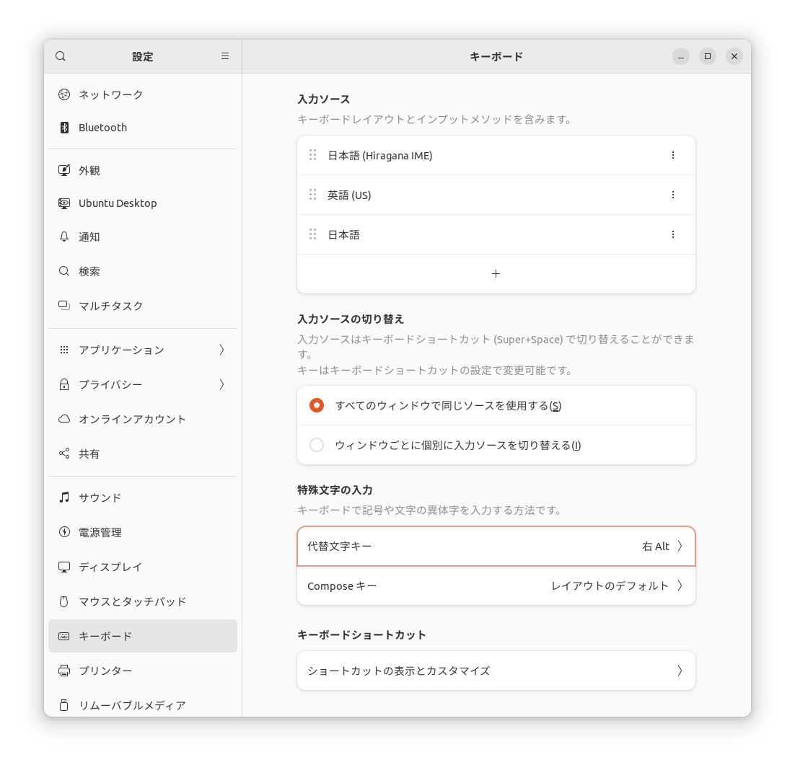

# 特殊とくしゅ文字もじの入力にゅうりょく

　右みぎAltキーをAltGrキーに設定せっていすると、キーボードで入力にゅうりょくできる文字もじや記号きごうをふやせます。
IMEの入力にゅうりょくモードは、「英数えいすうモード」でも「ひらがなモード」でもどちらでもかまいません。

## AltGrキーとは {: #altgr}

　AltGrは、“alternate graphic”の略りゃくです。
国くにによっては、キーボードのノーマル面めんとシフト面めんだけでは文字もじが、はいりきらないことがあります。
そうした国くにでは、AltGrキーをつかって、さらに文字もじ面めんを追加ついかしています。
　日本語にほんごにも、よくつかう文字もじで、キーボードからちょくせつ入力にゅうりょくできない文字もじがあります。
たとえば、郵便ゆうびん番号ばんごうの「〒」や、温度おんどの「℃」といった文字もじです。
「ひらがなIME」では、そうした文字もじをAltGrキーをつかって入力にゅうりょくすることができます。

## 右みぎAltキーをAltGrキーに設定せっていする方法ほうほう  {: #altgr-settings}

　GNOME環境かんきょうを利用りようしているばあいは、GNOMEの「設定せってい」をひらいて、「キーボード」を選択せんたくします。このなかの「特殊とくしゅ文字もじの入力にゅうりょく」にある「代替だいたい文字もじキー」を「右みぎAlt」に設定せっていします。

## AltGrキーをつかって入力にゅうりょくできる文字もじや記号きごう  {: #altgr-characters}

　AltGr面めんの文字もじを入力にゅうりょくするときは、AltGrキーをおさえながら、目的もくてきの文字もじのキーをおします。

### 例れい

キー コンビネーション | 入力にゅうりょくされる文字もじ
---|---
Alt Gr+1| 一
Alt Gr+2| 二
Alt Gr+p| π
Alt Gr+Shift+d| ℃

　AltGr面めんの文字もじの配置はいちはつぎの図ずのとおりです。英語えいごキーボードと日本語にほんごキーボードでは、文字もじの配置はいちされている位置いちがいちぶ異ことなります。

### 英語えいごキーボード

Backspace

 

Tab

 

Caps Lock

Enter

 

Shift

Shift

 

Ctrl

❖

Alt

Alt Gr

❖

☰

Ctrl

`

1

2

3

4

5

6

7

8

9

0

-

=

 

Q

W

E

R

T

Y

U

I

O

P

[

]

\

 

A

S

D

F

G

H

J

K

L

;

'

 

Z

X

C

V

B

N

M

,

.

/

 

~

!

@

#

$

%

^

&amp;

*

(

)

_

+

 

{

}

|

 

:

"

 

&lt;

&gt;

?

 

々

一

二

三

四

五

六

七

八

九

〇

—

≠

 

ヶ

®

〒

↑

π

‘

’

¥

 

§

°

←

↓

→

 

Ω

×

©

ゝ

µ

，

．

／

 

空白

≒

²

³

※

【

】

±

 

™

“

”

 

℃

 

✓

ゞ

≦

≧

÷

 

### 英語えいごDvorakキーボード

Backspace

 

Tab

 

Caps Lock

Enter

 

Shift

Shift

 

Ctrl

❖

Alt

Alt Gr

❖

☰

Ctrl

`

1

2

3

4

5

6

7

8

9

0

[

]

 

'

,

.

P

Y

F

G

C

R

L

/

=

\

 

A

O

E

U

I

D

H

T

N

S

-

 

;

Q

J

K

X

B

M

W

V

Z

 

~

!

@

#

$

%

^

&amp;

*

(

)

{

}

 

"

&lt;

&gt;

?

+

|

 

_

 

:

 

々

一

二

三

四

五

六

七

八

九

〇

‘

’

 

ヶ

，

．

π

↑

®

／

≠

¥

 

°

←

↓

→

§

—

 

ゝ

×

µ

Ω

 

空白

≒

²

³

※

【

】

“

”

 

≦

≧

©

™

÷

±

 

℃

〒

 

ゞ

✓

 

### 日本語にほんごキーボード

半角/ 全角&nbsp

⌫

 

Tab

Enter

 

英数

 

Shift

Shift

 

Ctrl

❖

Alt

無変換

変換

カタカナ

Alt Gr

❖

☰

Ctrl

1

2

3

4

5

6

7

8

9

0

-

^

\

 

Q

W

E

R

T

Y

U

I

O

P

@

[

 

A

S

D

F

G

H

J

K

L

;

:

]

 

Z

X

C

V

B

N

M

,

.

/

 

!

"

#

$

%

&amp;

'

(

)

_

=

~

|

 

`

{

 

+

*

}

 

&lt;

&gt;

?

_

 

一

二

三

四

五

六

七

八

九

〇

—

々

￥

 

ヶ

®

〒

↑

π

‘

 

§

°

←

↓

→

’

 

Ω

×

©

ゝ

µ

，

．

／

 

空白

²

³

【

】

≠
≒

 

™

“

 

℃

±

※

”

 

✓

ゞ

≦

≧

÷

 

