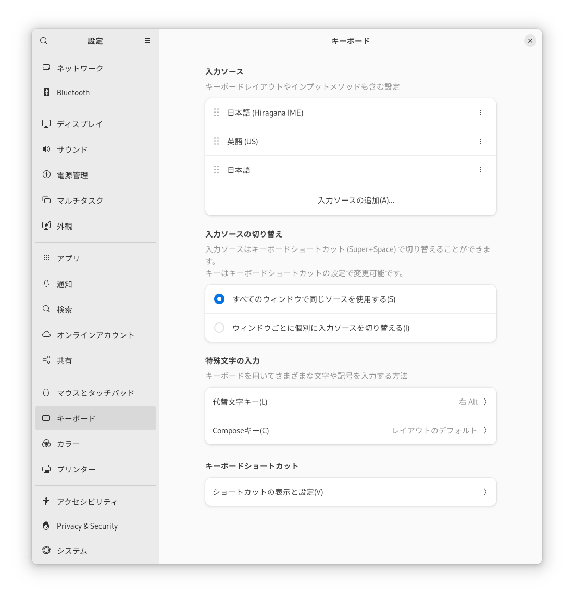

# インストール方法ほうほう

## ソフトウェア パッケージのインストール

　つかっているOSが、FedoraかUbuntuであれば、インストール用ようのソフトウェア パッケージを「[Releases](https://github.com/esrille/ibus-hiragana/releases)」ページからダウンロードできます。
　ダウンロードができたら、「Releases」ページの記載きさいにしたがって、パッケージをインストールしてください。
インストールが完了かんりょうしたら、いちどコンピューターを再さい起動きどうしてください。

### Waylandを使用しようするばあい

　Ubuntu 21.04以降いこうやFedora 25以降いこうでは、デフォルトで画面がめんの描画びょうがにWaylandをつかうようになっています。
Waylandは、ながくつかわれてきたXサーバーをおきかえるものです。
Waylandはまだまだあたらしく、きちんと対応たいおうできていないソフトウェアものこっています。
　IBusをWaylandで使用するばあいは、環境かんきょう変数へんすうGTK_IM_MODULEにibusを指定していしてください。
そうしないと、ただしい周辺しゅうへんテキストの情報じょうほうがIBusからIMEにおくられてきません。
そのためには、つぎの行を ~/.bash_profile (Fedoraなど)か ~/.profile (Ubuntuなど)に追加してください。

```
$ export GTK_IM_MODULE=ibus
```

## 入力にゅうりょくソースのセットアップ

　パッケージのインストールができたら、入力にゅうりょくソース(※)に「ひらがなIME」をセットアップしていきます。
入力にゅうりょくソースのセットアップ方法ほうほうは、デスクトップ環境かんきょうによってすこし異ことなります。

<br>※ キーボード配列はいれつやインプット メソッドのことをまとめて「[入力にゅうりょくソース](https://wiki.gnome.org/Design/OS/LanguageInput)」とよんでいます。

### GNOMEを利用りようしているとき

　FedoraやUbuntuでは、GNOMEが標準ひょうじゅんのデスクトップ環境かんきょうになっています。GNOMEを利用りようしているときは、GNOMEの「設定せってい」をひらいて、「キーボード」の「入力にゅうりょくソース」に、「日本語にほんご (Hiragana IME)」を追加ついかします。



### GNOME以外いがいを利用りようしているとき

　「IBusの設定せってい」ウィンドウをひらいて、「入力にゅうりょくメソッド」タブの「入力にゅうりょくメソッド」に、
<br><br>
　　 日本語にほんご - Hiragana IME
<br><br>
を追加ついかします。

## 「ひらがなIME」を有効ゆうこうにする

　IBusでは、複数ふくすうのインプットメソッドエンジンをつかうことができるようになっています。
　「ひらがなIME」を有効ゆうこうするには、デスクトップ シェルの「キーボード メニュー」をひらいて、「日本語 (Hiragana IME)」をえらびます。


　キーボード メニューは、トップバーの現在げんざいの入力にゅうりょくメソッドを表示ひょうじしている部分ぶぶん（「<nobr>ja</nobr>｣，｢<nobr>あ</nobr>」など）をクリックしてひらきます。
　「ひらがなIME」の基本的きほんてきなセットアップはこれで完了かんりょうです。
さらにこまかな設定せっていは、「[ひらがなIMEの設定せってい](settings.html)」ウィンドウでおこないます。

### パソコンにつなげるキーボードの種類しゅるいを指定していする方法ほうほう

　キーボードは国くにや言語げんごによってそのスイッチのレイアウトがことなります。
日本にほんでは、日本語にほんごキーボードのほかに英語えいご(US)キーボードも利用りようされています。
英語えいご(US)キーボードは、アメリカで一般的いっぱんてきにつかわれているキーボードです。
USはUnited States (of America)の略りゃくです。
英語えいごキーボードでも、イギリスのものはアメリカのものとまたすこしキーボード レイアウトがちがいます。
　「ひらがなIME」で英語えいご(US)キーボードを利用りようしたいときは、まず、入力にゅうりょくソースから「英語えいご(US)」を選択せんたくします。そのあとで、入力にゅうりょくソースから「日本語にほんご(Hiragana IME)」を選択せんたくします。
　「ひらがなIME」で日本語にほんごキーボードを利用りようしたいときは、まず、入力にゅうりょくソースから「日本語にほんご」を選択せんたくします。そのあとで、入力にゅうりょくソースから「日本語にほんご(Hiragana IME)」を選択せんたくします。
　「ひらがなIME」は直前ちょくぜんに指定していされていたキーボード レイアウトにあわせて動作どうさするようになっています。
使用しようするキーボードのレイアウトがみつからないときは、GNOMEの「設定せってい」をひらいて、「キーボード」の「入力にゅうりょくソース」に追加ついかしてください。

<br>※ 「ひらがなIME」は、現在げんざい、「日本語にほんご」,「英語えいご(US)」,「英語えいご(Dvorak)」の３つのキーボード レイアウトをサポートしています。

## じぶんでビルドしてインストールする方法ほうほう

　「ひらがなIME」をじぶんでビルドしてインストールしたいときは、つぎの手順てじゅんでできます。

```
$ git clone https://github.com/esrille/ibus-hiragana.git
$ ./autogen.sh  --prefix=/usr [--enable-dic]
$ make
$ sudo make install
```

　autogen.shは、autotoolsの設定せっていをおこない、configureスクリプトよびだします。
--enable-dicを指定していすると、漢字かんじ辞書じしょもメイクしなおすことができます。
　ビルドするときに必要ひつようなパッケージについては、debian/controlのBuild-Depends、あるいは、ibus-hiragana.spec.inのBuildRequiresを参考さんこうにしてください。
