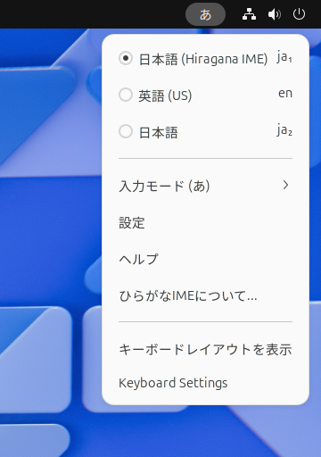

# インストール方法ほうほう

　「ひらがなIME」を利用りようできるようにするには、つぎの手順てじゅんでセットアップをすすめていきます。

1. [「ひらがなIME」のソフトウェア パッケージをインストールする](#install)
2. [「ひらがなIME」をOSの入力ソースに追加ついかする](#input-source)
3. [「ひらがなIME」を有効ゆうこうにする](#enable)
4. [Wayland用ようの設定せっていをする（GNOME 46よりまえのばあい）](#wayland)

## ソフトウェア パッケージをインストールする {: #install}

　FedoraかUbuntuをつかっているときは、かんたんなコマンドで「ひらがなIME」をインストールすることができます。

### Fedoraのばあい

　Fedora用ようのソフトウェア パッケージはCoprプロジェクト「[@esrille/releases](https://copr.fedorainfracloud.org/coprs/g/esrille/releases/)」から提供ていきょうしています。
このCoprプロジェクトを有効ゆうこうにするには、いちど、コマンドラインからつぎのように実行じっこうします。

```
sudo dnf copr enable @esrille/releases
```

　そのあとは、いつものように、dnfコマンドで「ひらがなIME」をインストールできます。

```
sudo dnf update
sudo dnf install ibus-hiragana
```

### Ubuntuのばあい

　Ubuntu用ようのソフトウェア パッケージはPPAレポジトリ「[esrille/releases](https://launchpad.net/~esrille/+archive/ubuntu/releases)」から提供ていきょうしています。
このPPAレポジトリを有効ゆうこうにするには、いちど、コマンドラインからつぎのように実行じっこうします。

```
sudo add-apt-repository ppa:esrille/releases
```

　そのあとは、いつものように、aptコマンドで「ひらがなIME」をインストールできます。
```
sudo apt update
sudo apt install ibus-hiragana
```

### ソースコードからインストールするばあい

　「ひらがなIME」をソースコードからビルドしてインストールするには、つぎのようにします。

```
git clone https://github.com/esrille/ibus-hiragana.git
cd ibus-hiragana
./autogen.sh  --prefix=/usr [--enable-dic] [--enable-html]
make
sudo make install
```

　autogen.shは、autotoolsの設定せっていをおこない、configureスクリプトよびだします。
--enable-dicを指定していすると、漢字かんじ辞書じしょもビルドすることができます。
--enable-htmlを指定していすると、ヘルプ用のhtmlファイルをビルドすることができます。
　ビルドするときに必要ひつようなパッケージについては、debian/controlのBuild-Depends、あるいは、ibus-hiragana.specのBuildRequiresを参考さんこうにしてください。
　Fedoraであれば、つぎのコマンドでビルドに必要なパッケージをインストールできます。

```
sudo yum-builddep ibus-hiragana.spec
```

　Ubuntuであれば、つぎのコマンドでビルドに必要なパッケージをインストールできます。
```
sudo apt build-dep .
```

## OSの入力にゅうりょくソースに追加ついかする {: #input-source}

　ソフトウェア パッケージのインストールができたら、いちどコンピューターを再さい起動きどうしてください。
　つづいて、OSの「入力にゅうりょくソース(※)」に「ひらがなIME」を追加ついかします。
入力にゅうりょくソースの設定せっていのしかたは、デスクトップ環境かんきょうによってすこし異ことなります。

<br>※ キーボード配列はいれつやインプット メソッドのことをまとめて「[入力にゅうりょくソース](https://wiki.gnome.org/Design/OS/LanguageInput)」とよんでいます。

### GNOMEを利用りようしているとき

　FedoraやUbuntuでは、GNOMEが標準ひょうじゅんのデスクトップ環境かんきょうになっています。GNOMEを利用りようしているときは、GNOMEの「設定せってい」をひらいて、「キーボード」の「入力にゅうりょくソース」に、「日本語にほんご (Hiragana IME)」を追加ついかします。


### GNOME以外いがいを利用りようしているとき

　「IBusの設定せってい」ウィンドウをひらいて、「入力にゅうりょくメソッド」タブの「入力にゅうりょくメソッド」に、
<br><br>
　　 日本語にほんご - Hiragana IME
<br><br>
を追加ついかします。

## 「ひらがなIME」を有効ゆうこうにする {: #enable}

　IBusでは、複数ふくすうのIMEをきりかえて、つかうことができます。
　「ひらがなIME」を有効ゆうこうするには、デスクトップ シェルの「キーボード メニュー」をひらいて、「日本語 (Hiragana IME)」をえらびます。
「キーボード メニュー」は、トップバーの現在げんざいの入力にゅうりょくメソッドを表示ひょうじしている部分ぶぶん（「<nobr>ja</nobr>｣，｢<nobr>あ</nobr>」など）をクリックしてひらきます。



　なお、「ひらがなIME」は直前ちょくぜんに指定していされていたキーボード レイアウトをつかって動作どうさするようになっています。

- 日本語にほんごキーボードを利用りようするときは、まず、入力にゅうりょくソースから「日本語にほんご」を選択せんたくします。そのあとで、入力にゅうりょくソースから「日本語にほんご(Hiragana IME)」を選択せんたくします。
- 英語えいご(US)キーボードを利用りようするときは、まず、入力にゅうりょくソースから「英語えいご(US)」を選択せんたくします。そのあとで、入力にゅうりょくソースから「日本語にほんご(Hiragana IME)」を選択せんたくします。

　使用しようするキーボードのレイアウトがみつからないときは、GNOMEの「設定せってい」をひらいて、「キーボード」の「入力にゅうりょくソース」にレイアウトを追加ついかしてください。
「ひらがなIME」は、いまのところ、「日本語にほんご」,「英語えいご(US)」,「英語えいご(Dvorak)」の３つのキーボード レイアウトをサポートしています。

<br>
**メモ**: キーボードは国くにや言語げんごによってスイッチのレイアウトがことなります。
日本にほんでは、日本語にほんごキーボードのほかに英語えいご(US)キーボードも利用りようされています。
英語えいご(US)キーボードは、アメリカで一般的いっぱんてきにつかわれているキーボードです。
USはUnited States (of America)の略りゃくです。
英語えいごキーボードでも、イギリスのものはアメリカのものとまたすこしキーボード レイアウトがちがいます。

## Wayland用ようの設定せっていをする（GNOME 46よりまえのばあい） {: #wayland}

　Ubuntu 21.04以降いこうやFedora 25以降いこうでは、デフォルトで画面がめんの描画びょうがにWaylandをつかうようになっています。
Waylandは、ながくつかわれてきたXサーバーをおきかえるものです。
　GNOME 46以降いこうでは、Waylandでも「ひらがなIME」をそのままつかえるようになっています。
GNOMEのバージョンは、GNOMEの[設定せってい]ウィンドウをひらいて、[このシステムについて]—[システムの詳細しょうさい設定せってい]をしらべると確認かくにんできます。
　ふるいWaylandベースのシステムで「ひらがなIME」を使用しようされるときは、環境かんきょう変数へんすうGTK_IM_MODULEにibusを指定していしてください。
そのためには、つぎの行ぎょうを ~/.bash_profile (Fedoraなど)か ~/.profile (Ubuntuなど)に追加ついかして、ログインしなおしてください。

```
export GTK_IM_MODULE=ibus
```

このようにしておかないと、ただしい周辺しゅうへんテキストの情報じょうほうがIMEにおくられてきません。

<br>
　「ひらがなIME」の基本的きほんてきなセットアップはこれで完了かんりょうです。
さらにこまかな設定せっていは、「[ひらがなIMEの設定せってい](settings.html)」ウィンドウでおこないます。

