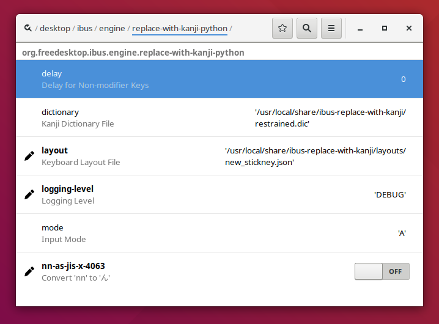
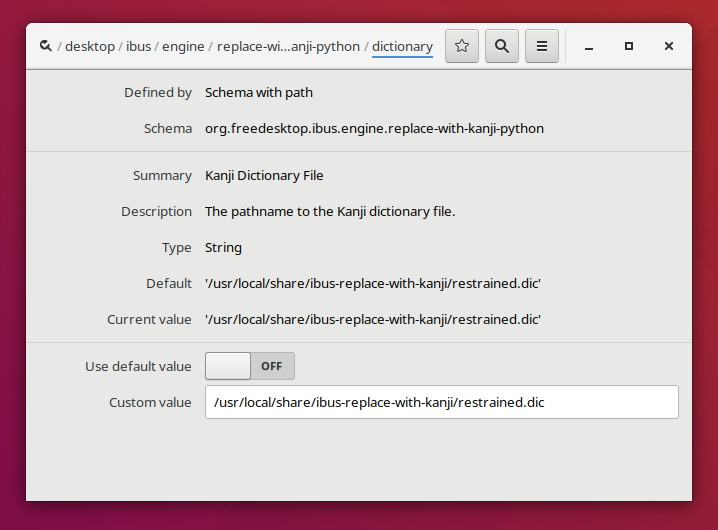
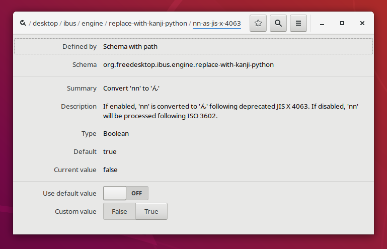

# 設定せっていのかえかた

　「ひらがなIME」には、つぎのような設定せってい項目こうもくがあります。

- [漢字かんじ辞書じしょ](#dictionary) ― 学年がくねん別べつの漢字かんじ辞書じしょをえらべます。
- [入力にゅうりょく方法ほうほう](#layout) ― ローマ字じ入力にゅうりょくとかな入力にゅうりょくのきりかえができます。
- [ローマ字じの「ん」のつづりかた](#nn) ― 「nn」を「ん」にするかどうかをえらべます。

　設定せっていの変更へんこうは、「dconf Editor」をつかうのが、いまのところ、かんたんです。「dconf Editor」で、
```
/desktop/ibus/engine/replace-with-kanji
```
をひらくと、「ひらがなIME」の設定せってい画面がめんになります。



「dconf Editor」で設定せっていを変更へんこうすると、自動的じどうてきに設定せっていが反映はんえいされます。

## 漢字かんじ辞書じしょをえらぶ {#dictionary}

　つぎの漢字かんじ辞書じしょファイルをあらかじめ用意よういしています。

設定せっていファイル名 | 解説かいせつ
------------ | -------------
restrained.dic | 最初さいしょに設定せっていされている辞書じしょ。常用じょうよう漢字かんじを基本きほんに構成こうせいした辞書じしょです。
restrained.1.dic | 小学校しょうがっこう1年ねん生せい用よう。
restrained.2.dic | 小学校しょうがっこう2年ねん生せい用よう。
restrained.3.dic | 小学校しょうがっこう3年ねん生せい用よう。
restrained.4.dic | 小学校しょうがっこう4年ねん生せい用よう。
restrained.5.dic | 小学校しょうがっこう5年ねん生せい用よう。
restrained.6.dic | 小学校しょうがっこう6年ねん生せい用よう。
restrained.7.dic | 中学生ちゅうがくせい用よう。
restrained.9.dic | 許容きょようされているおくりがなをつかうための辞書じしょ。

　小中学生しょうちゅうがくせい用ようの辞書じしょでは、使用しようする漢字かんじとそのよみを、平成へいせい29年ねんの『[音訓おんくんの小しょう・中ちゅう・高等学校こうとうがっこう段階だんかい別べつ割わり振ふり表ひょう](http://www.mext.go.jp/a_menu/shotou/new-cs/1385768.htm)』にそって限定げんていしてあります。

　標準ひょうじゅんの辞書じしょ(restrained.dic)では、おくる位置いちが『[送おくり仮名かなの付つけ方かた](http://www.bunka.go.jp/kokugo_nihongo/sisaku/joho/joho/kijun/naikaku/okurikana/index.html)』の原則げんそくにそっていないと活用かつようを変換へんかんできません。
辞書じしょにrestrained.9.dicを指定していすると、許容きょようされているおくりがなのおくりかたでも活用かつようを変換へんかんできるようになります。

例れい)  restrained.9.dicをつかうと、「落おとす」のような変換へんかんもできます。

    お―とす〔変換〕 → 落とす
    おと―す〔変換〕 → 落す

<br>　使用しようする辞書じしょを変更へんこうするときは、「dictionary」を選択せんたくして、辞書じしょのファイル名めいをフルパス名めいで指定していしてください。

例れい (インストール先さきが /usr のばあい) :

    /usr/share/ibus-replace-with-kanji/restrained.dic

<br>


### 個人こじん用よう辞書じしょ

　システムの辞書じしょファイルにない単語たんごは、個人こじん用ようの辞書じしょファイルにいれておくことができます。個人こじん用ようの辞書じしょは、ディレクトリ ~/.local/share/ibus-replace-with-kanji/ のなかの my.dic というなまえのファイルです。追加ついかした単語たんごは、次回じかいIBusデーモンを起動きどうしたときから、つかえるようになります。

　辞書じしょファイルには、つぎのテキスト形式けいしきで単語たんごを保存ほぞんします。

```
; コメント
; よみ /単語/
きれい /綺麗/
; よみ /単語1/単語2/
こーひー /珈琲/咖啡/
; 用言のよみは、おくりがなの手前まで指定して水平バーでとめます。
; 漢字は、5段活用動詞は、最後にkgstnbmrwをつけます(kは、カ行をしめします)。
ささや― /囁k/
; 形容詞は、最後にiをつけます。
あお― /碧i/
```

## 入力にゅうりょく方法ほうほうをえらぶ {#layout}

　入力にゅうりょく方法ほうほうはキーボード配列はいれつの設定せっていファイルを変更へんこうして設定せっていします。

入力にゅうりょく方法ほうほう | キーボード配列はいれつ | 設定せっていファイル名めい<br>（日本語にほんごキーボード用よう）| 設定せっていファイル名めい<br>（英語えいごキーボード用よう）
---|---|---|---
かな入力にゅうりょく | [JISかな配列はいれつ](layouts.html#jis) | jis.109.json | なし
ローマ字じ入力にゅうりょく | [99式しきローマ字じ用よう](layouts.html#roomazi) | roomazi.109.json | roomazi.json 
かな入力にゅうりょく | [ニュー スティックニー配列はいれつ](layouts.html#new_stickney) | new_stickney.109.json | new_stickney.json

　ファイル名めいに「.109」がふくまれているものは、日本語にほんごキーボード用ようです。
配列はいれつの内容ないようはJSONでかかれています。
通常つうじょうのテキスト エディターをつかって、まったくあたらしい配列はいれつを定義ていぎしてつかうこともできます。

　キーボードの配列はいれつを変更へんこうするには、「layout」を選択せんたくして、設定せっていファイル名めいをフルパス名めいで指定していします。

<br>例れい (インストール先さきが /usr のばあい) :

    /usr/share/ibus-replace-with-kanji/layouts/roomazi.109.json

<br>


## ローマ字じの「ん」のつづりをえらぶ {#nn}

　ワープロでは、「nn」と入力にゅうりょくすると「ん」になる便法べんぽうがつかわれてきました。
ふたつめの「n」は、おしにくい〔'〕のかわりです。
「’」は、「はねる音を表わすnと次にくる母音字またはyとを切り離す必要がある場合には、nの次に’を入れる」というのが、もともとの[約束やくそく](http://www.mext.go.jp/b_menu/hakusho/nc/k19541209001/k19541209001.html)です。
この約束やくそくにしたがうと、「tennen」は「てんねん」になります。けれども、ワープロではこれを「てんえん」とする方法ほうほうがひろくつかわれています（参考さんこう: 『[JIS X 4063の廃止はいし](https://srad.jp/~yasuoka/journal/518878/)』)。

　「ひらがなIME」では、ワープロ方式ほうしきも公式こうしきな方式ほうしきも、どちらでもつかうことができます。初期しょき設定せっていはワープロ方式ほうしきです。つづりかたを変更へんこうするには、「nn-as-jis-x-4063」を選択せんたくして、TrueかFalseをえらびます。

設定せってい | 内容ないよう
---|---
True | ワープロ式しきのつづりかたをつかいます。「nn」と入力にゅうりょくすると「ん」になります。
False | 正式せいしきなローマ字じのつづりかたをつかいます。


