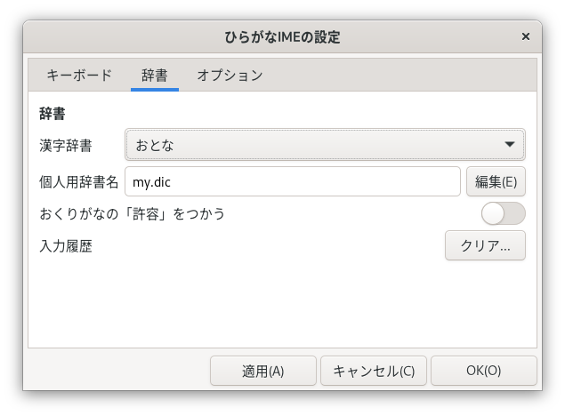

# 設定せっていのかえかた

## 「ひらがなIMEの設定せってい」ウィンドウ {#ibus-setup-hiragana}

　「ひらがなIME」の設定せっていを変更へんこうするには、「ひらがなIMEの設定せってい」ウィンドウをつかいます。
「ひらがなIMEの設定せってい」ウィンドウをひらくには、トップバーの現在げんざいの入力にゅうりょくモードを表示ひょうじしている部分ぶぶん（「あ▼」など）をクリックして、[設定せってい]をえらびます。

<br>


　「ひらがなIMEの設定せってい」ウィンドウには、つぎのようなタブがあります。

- [キーボード](#layout) ― 使用しようするキーボードの種類しゅるいや入力にゅうりょく方法ほうほうをえらびます。
- [辞書じしょ](#dictionary) ― 使用しようする漢字かんじ辞書じしょを設定せっていします。「ひらがなIME」では、学年がくねん別べつの漢字かんじ辞書じしょをえらべます。

　変更へんこうした内容ないようは、[適用てきよう]ボタンをおすと、「ひらがなIME」にすぐ反映はんえいされます。

## [キーボード] タブ {#layout}

　キーボードの入力にゅうりょく方法ほうほうは、「ひらがなIMEの設定せってい」ウィンドウの[キーボード]タブで設定せっていします。

<br>


　キーボードの配列はいれつは、つぎの３種類しゅるいから、えらぶことができます。

入力にゅうりょく方法ほうほう | キーボードの配列はいれつ
---|---
ローマ字じ入力にゅうりょく | [99式しきローマ字じ用よう](layouts.html#roomazi)
かな入力にゅうりょく | [JISかな配列はいれつ](layouts.html#jis)
かな入力にゅうりょく | [ニュー スティックニー配列はいれつ](layouts.html#new_stickney)

　キーボードの種類しゅるいは、[日本語にほんごキーボード]と[英語えいご(US)キーボード]のどちらかをえらべます。
ただし、キーボードの配列はいれつを[JISかな配列はいれつ]にしたばあいは、かならず、[日本語にほんごキーボード]になります。

### ローマ字じの「ん」のつづりかた {#nn}

　「ん」をいつも「nn」で入力にゅうりょくしたいときは、『'nn'をかならず「ん」に変換へんかんする』をオンにします。
　ワープロでは、「nn」と入力にゅうりょくすると「ん」になる便法べんぽうがつかわれてきました。
ふたつめの「n」は、日本語にほんごキーボードではおしにくい〔'〕のかわりです。
現在げんざいは、このワープロの方式ほうしきをさだめたJIS規格きかくは廃止はいしされています。

<br>参考さんこう: 『[JIS X 4063の廃止はいし](https://srad.jp/~yasuoka/journal/518878/)』。

## [辞書じしょ] タブ {#dictionary}

　「ひらがなIME」は、学年がくねん別べつの漢字かんじ辞書じしょファイルを用意よういしています。
使用しようする漢字かんじ辞書じしょは、[辞書じしょ]タブをひらいて設定せっていします。

<br>


　つかいたい辞書じしょは、「漢字かんじ辞書じしょ」コンボボックスからえらびます。
小中学生しょうちゅうがくせい用ようの辞書じしょでは、使用しようする漢字かんじとそのよみを、平成へいせい29年ねんの『[音訓おんくんの小しょう・中ちゅう・高等学校こうとうがっこう段階だんかい別べつ割わり振ふり表ひょう](http://www.mext.go.jp/a_menu/shotou/new-cs/1385768.htm)』にそって限定げんていしてあります。

　標準ひょうじゅんの「おとな用よう(おくりがな: 本則ほんそく)」辞書じしょでは、おくる位置いちが『[送おくり仮名かなの付つけ方かた](http://www.bunka.go.jp/kokugo_nihongo/sisaku/joho/joho/kijun/naikaku/okurikana/index.html)』の原則げんそくにそっていないと活用かつようを変換へんかんできません。
辞書じしょを「おとな用よう(おくりがな: 本則ほんそく+許容きょよう)」にすると、許容きょようされているおくりがなのおくりかたでも活用かつようを変換へんかんできるようになります。

<br>例れい)  「おとな用よう(おくりがな: 本則ほんそく+許容きょよう)」辞書じしょをつかうと、「落おとす」のような変換へんかんもできます。

    お―とす〔変換〕 → 落とす
    おと―す〔変換〕 → 落す

### 個人こじん用よう辞書じしょ

　「ひらがなIME」の漢字かんじ辞書じしょにない単語たんごは、個人こじん用ようの辞書じしょファイルに登録とうろくできます。個人こじん用ようの辞書じしょファイルは、ディレクトリ ~/.local/share/ibus-hiragana/ のなかに保存ほぞんされています。はじめは my.dic というなまえになっています。
　個人こじん用よう辞書じしょは、[編集へんしゅう]ボタンをおすと編集へんしゅうできます。個人こじん用よう辞書じしょファイルには、したのような形式けいしきで単語たんごを保存ほぞんします。

```
; セミコロン(;)ではじまる行はコメントです。
; よみ /単語/
きれい /綺麗/
; よみ /単語1/単語2/
かいざん /改竄/改ざん/
; 用言のよみは、おくりがなの手前まで指定して水平バーでとめます。
; 五段活用動詞の漢字には、最後にkgstnbmrwをつけます(kは、カ行をしめします)。
ささや― /囁k/
; 形容詞は、最後にiをつけます。
あお― /碧i/
```

　編集へんしゅうした最新さいしんの個人こじん用よう辞書じしょをつかうには、「辞書じしょを読よみなおす」スイッチをオンにして[適用てきよう]ボタンをおします。
　複数ふくすうの個人こじん用よう辞書じしょファイルをつかいわけることもできます。そのときは、利用りようしたい個人こじん用よう辞書じしょのファイル名めいを「個人こじん用よう辞書じしょ名めい」テキストボックスに指定していしておきます。

### 入力にゅうりょく履歴りれきのクリア

　同音どうおん異義いぎ語ごやよみを短縮たんしゅくしたことばの変換へんかん中ちゅうは、よくつかうものが一覧いちらんのはじめのほうにきます。
これを初期しょき状態じょうたいにもどしたいときは、「入力にゅうりょく履歴りれきをクリアする」スイッチをオンにして[適用てきよう]ボタンをおします。
