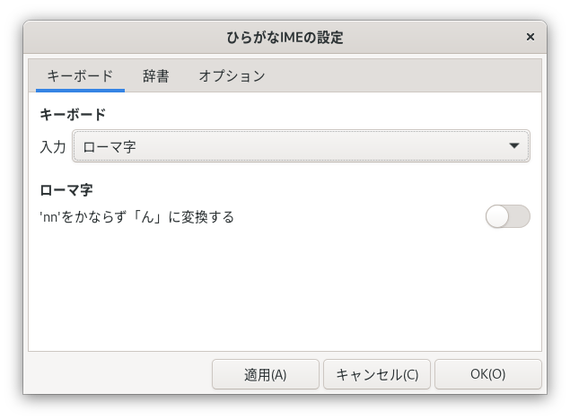

# 設定せっていのかえかた

## 「ひらがなIMEの設定せってい」ウィンドウ {#ibus-setup-hiragana}

　「ひらがなIME」の設定せっていを変更へんこうするには、「ひらがなIMEの設定せってい」ウィンドウをつかいます。
「ひらがなIMEの設定せってい」ウィンドウをひらくには、トップバーの現在げんざいの入力にゅうりょくモードを表示ひょうじしている部分ぶぶん（「あ▼」など）をクリックして、[設定せってい]をえらびます。

<br>


　「ひらがなIMEの設定せってい」ウィンドウには、つぎのようなタブがあります。

- [キーボード](#layout) ― 使用しようするキーボードの種類しゅるいや入力にゅうりょく方法ほうほうをえらびます。
- [辞書じしょ](#dictionary) ― 使用しようする漢字かんじ辞書じしょを設定せっていします。「ひらがなIME」では、学年がくねん別べつの漢字かんじ辞書じしょをえらべます。

　変更へんこうした内容ないようは、[適用てきよう]ボタンをおすと、「ひらがなIME」にすぐ反映はんえいされます。

## [キーボード] タブ {#layout}

　キーボードの入力にゅうりょく方法ほうほうは、「ひらがなIMEの設定せってい」ウィンドウの[キーボード]タブで設定せっていします。

<br>


　キーボードの配列はいれつは、つぎの３種類しゅるいから、えらぶことができます。

入力にゅうりょく方法ほうほう | キーボードの配列はいれつ
---|---
ローマ字じ入力にゅうりょく | [99式しきローマ字じ用よう](layouts.html#roomazi)
かな入力にゅうりょく | [JISかな配列はいれつ](layouts.html#jis)
かな入力にゅうりょく | [ニュー スティックニー配列はいれつ](layouts.html#new_stickney)

　キーボードの種類しゅるいは、[日本語にほんごキーボード]と[英語えいご(US)キーボード]のどちらかをえらべます。
ただし、キーボードの配列はいれつを[JISかな配列はいれつ]にしたばあいは、かならず、[日本語にほんごキーボード]になります。

### ローマ字じの「ん」のつづりかた {#nn}

　「ん」をいつも「nn」で入力にゅうりょくしたいときは、『'nn'をかならず「ん」に変換へんかんする』をオンにします。
　ワープロでは、「nn」と入力にゅうりょくすると「ん」になる便法べんぽうがつかわれてきました。
ふたつめの「n」は、日本語にほんごキーボードではおしにくい〔'〕のかわりです。
現在げんざいは、このワープロの方式ほうしきをさだめたJIS規格きかくは廃止はいしされています。

<br>参考さんこう: 『[JIS X 4063の廃止はいし](https://srad.jp/~yasuoka/journal/518878/)』。

## [辞書じしょ] タブ {#dictionary}

　「ひらがなIME」は、学年がくねん別べつの漢字かんじ辞書じしょファイルを用意よういしています。
使用しようする漢字かんじ辞書じしょは、[辞書じしょ]タブをひらいて設定せっていします。

<br>


　つかいたい辞書じしょは、「漢字かんじ辞書じしょ」コンボボックスからえらびます。
小中学生しょうちゅうがくせい用ようの辞書じしょでは、使用しようする漢字かんじとそのよみを、平成へいせい29年ねんの『[音訓おんくんの小しょう・中ちゅう・高等学校こうとうがっこう段階だんかい別べつ割わり振ふり表ひょう](http://www.mext.go.jp/a_menu/shotou/new-cs/1385768.htm)』にそって限定げんていしてあります。

　標準ひょうじゅんの「おとな用よう(おくりがな: 本則ほんそく)」辞書じしょでは、おくる位置いちが『[送おくり仮名かなの付つけ方かた](http://www.bunka.go.jp/kokugo_nihongo/sisaku/joho/joho/kijun/naikaku/okurikana/index.html)』の原則げんそくにそっていないと活用かつようを変換へんかんできません。
辞書じしょを「おとな用よう(おくりがな: 本則ほんそく+許容きょよう)」にすると、許容きょようされているおくりがなのおくりかたでも活用かつようを変換へんかんできるようになります。

<br>例れい)  「おとな用よう(おくりがな: 本則ほんそく+許容きょよう)」辞書じしょをつかうと、「落おとす」のような変換へんかんもできます。

    お―とす〔変換〕 → 落とす
    おと―す〔変換〕 → 落す

### 個人こじん用よう辞書じしょ

　「ひらがなIME」の標準ひょうじゅんの漢字かんじ辞書じしょにない語ごは、個人こじん用ようの辞書じしょファイルに登録とうろくできます。
個人こじん用ようの辞書じしょファイルは、ディレクトリ ~/.local/share/ibus-hiragana/ のなかに保存ほぞんされています。
はじめは my.dic というなまえになっています。
　個人こじん用よう辞書じしょは、[編集へんしゅう]ボタンをおすと編集へんしゅうできます。個人こじん用よう辞書じしょファイルには、したのような形式けいしきで語ごを保存ほぞんします。
動詞どうしや形容詞けいようしなどの登録とうろくのしかたは、このあとの「[おくりがなのある語ごの登録とうろくのしかた](#okurigana)」でくわしく説明せつめいします。

```
; セミコロン(;)ではじまる行はコメントです。
; 単語は、「よみ」, 半角スペース, そのあとにスラッシュ(/)で語をかこんで登録します。
きれい /綺麗/
; おなじよみの語は一行にまとめて登録できます。
かいざん /改竄/改ざん/
; おくりがなのある語のよみは、漢字におきかえる部分だけをかいて、水平バー（―）でとめます。
ささや― /囁k/
あお― /碧i/
```

　編集へんしゅうした最新さいしんの個人こじん用よう辞書じしょをつかうには、「辞書じしょを読よみなおす」スイッチをオンにして[適用てきよう]ボタンをおします。
　複数ふくすうの個人こじん用よう辞書じしょファイルをつかいわけることもできます。
そのときは、利用りようしたい個人こじん用よう辞書じしょのファイル名めいを「個人こじん用よう辞書じしょ名めい」テキストボックスに指定していしておきます。

### おくりがなのある語ごの登録とうろくのしかた {#okurigana}

　「ひらがなIME」の辞書じしょにおくりがなのある語ごを登録とうろくするときのかきかたは、つぎのとおりです。
「よみ」の部分ぶぶんには、漢字かんじにおきかえる部分ぶぶんだけ、かなでかいて、水平バー（―）でとめます。
「語ご」の部分ぶぶんのかきかたは、以下のように品詞ひんしや活用形かつようけいによってかわってきます。

#### 五段だん活用かつようの動詞どうし

　「語ご」の部分ぶぶんには、漢字かんじ・（もしあれば）活用語尾かつようごびのまえのおくりがな・活用語尾かつようごびの記号きごう（kgstnbmrwのどれかひとつ）をかきます。

行ぎょう | よみ | 語ご
---|---|---
カ行ぎょう | か― | 書k
ガ行ぎょう | およ― | 泳g
サ行ぎょう | ち― | 散らs
タ行ぎょう | う― | 打t
ナ行ぎょう | し― | 死n
バ行ぎょう | あそ― | 遊b
マ行ぎょう | あか― | 赤らm
ラ行ぎょう | あず― | 預かr
ワア行ぎょう | あ― | 会w

#### 上かみ一段いちだん活用かつよう/下しも一段いちだん活用かつようの動詞どうし

　「語ご」の部分ぶぶんには、漢字かんじと活用かつよう語尾ごびのさいしょの一文字もじ（イ段だんもしくはエ段だんの文字もじ）をかきます。

活用かつよう | よみ | 語ご
---|---|---
上かみ一段いちだん | お― | 起き
下しも一段いちだん | み― | 見え

#### 形容詞けいようし（イ形容詞けいようし）

　「語ご」の部分ぶぶんには、漢字かんじ・（もしあれば）活用語尾かつようごびのまえのおくりがな・活用語尾かつようごびの記号きごう（i）をかきます。

よみ | 語ご
---|---
あか― | 赤i
つめ― | 冷たi

#### 形容動詞けいようどうし（ナ形容詞けいようし）

　「語ご」の部分ぶぶんには、漢字かんじと語幹ごかん部分ぶぶんのおくりがなをかきます。

よみ | 語ご
---|---
あき― | 明らか
しず― | 静か

#### そのほかの語ごのおくりがな

　「語ご」の部分ぶぶんには、漢字かんじとおくりがなをそのままかきます。

よみ | 語ご
---|---
ひと― | 独り
すこ― | 少し

### 入力にゅうりょく履歴りれきのクリア

　同音どうおん異義いぎ語ごやよみを短縮たんしゅくしたことばの変換へんかん中ちゅうは、よくつかうものが一覧いちらんのはじめのほうにきます。
これを初期しょき状態じょうたいにもどしたいときは、「入力にゅうりょく履歴りれきをクリアする」スイッチをオンにして[適用てきよう]ボタンをおします。
