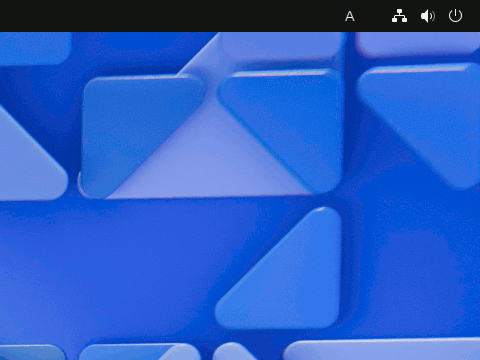

# つかいかた

※ ローマ字じ入力にゅうりょくとかな入力にゅうりょくのきりかえは、「[設定せっていのかえかた ― [キーボード] タブ](settings.html#layout)」でおこないます。

## 入力にゅうりょくモードのかえかた {: #input-mode}

　「ひらがなIME」には、したの表ひょうのような５つの入力にゅうりょくモードがあります。

入力にゅうりょくモードの表示ひょうじ | モードのなまえ | 解説かいせつ
:---:|---|---
あ | ひらがなモード | 漢字かんじかなまじり文ぶんを入力にゅうりょくするモードです。
A | 英えい数すうモード | 英語えいごのアルファベットや数字すうじを入力にゅうりょくするモードです。
ア | カタカナ モード | カタカナを入力にゅうりょくするモードです。
Ａ | 全角ぜんかく英えい数すうモード | アルファベットや数字すうじを全角ぜんかく文字もじで入力にゅうりょくするモードです。
ｱ | 半角はんかくカタカナ モード | カタカナを半角はんかく文字もじで入力にゅうりょくするモードです。

 
　現在げんざいの入力にゅうりょくモードは、画面がめんのトップバーの右みぎすみに表示ひょうじされています。

　ふだんよくつかう入力にゅうりょくモードは、「ひらがなモード」と「英えい数すうモード」です。
そのほかのモードをつかうことは、ほとんどありません。

- 日本語にほんごキーボードでは、変換キーをおすと「ひらがなモード」に、無変換キーをおすと「英数えいすうモード」に変更へんこうできます。
- 英語えいごキーボードでは、Caps Lockをオンにすると「ひらがなモード」に、オフにすると「英数えいすうモード」にできます。

## 漢字かんじやカタカナの単語たんごの入力にゅうりょく {: #input-kanji}

　漢字かんじやカタカナの単語たんごも、まずはひらがなで入力にゅうりょくします。
つぎに、その単語たんごのまうしろにカーソルがあるときに変換キーをおします。
そうすると、単語たんごを漢字かんじやカタカナに変換へんかんできます。
　たとえば、「しろうとむけのワープロの登場とうじょうを期待きたいしたいですね。」という文ぶんを入力にゅうりょくするには、「ひらがなモード」で、つぎのようにキーボードをうちます。

<pre><code>しろうとむけのわーぷろ変換のとうじょう変換をきたい変換したいですね。
</code></pre>

 **同音どうおん異義いぎ語ご**:　漢字かんじの単語たんごには、「衛星えいせい」と「衛生えいせい」のように、おなじよみかたをする単語たんごがふたつ以上いじょうあることがあります。
そのような単語たんごのことを同音どうおん異義いぎ語ごといいます。
同音どうおん異義いぎ語ごがあるときは、変換キーをつかって目的もくてきの単語たんごをえらんでから入力にゅうりょくをつづけます。
目的もくてきの単語たんごは上下じょうげのカーソル キーでえらぶこともできます。
　あとで、おなじ同音どうおん異義いぎ語ごを変換へんかんするときには、さいごにえらんだ単語たんごがはじめにでてきます。
あまりつかわない同音どうおん異義いぎ語ごは、一覧いちらんのあとのほうにさがっていきます。
そのため、同音どうおん異義いぎ語ごのなかから単語たんごをえらぶ操作そうさは、しなくてもよくなっていきます。

## おくりがなのある単語たんごの入力にゅうりょく {: #input-okurigana}

　おくりがなのある単語たんごを入力にゅうりょくするときも、漢字かんじでかく部分ぶぶんのまうしろで<nobr>変換</nobr>キーをおします。
「赤あかいチューリップの花はなが咲さきました。」という文ぶんを入力にゅうりょくするには、つぎのようにキーボードをうちます。

<pre><code>あか変換いちゅーりっぷ変換のはな変換がさ変換きました。
</code></pre>

　変換へんかん候補こうほが複数ふくすうあるときは、そのなかから、さいごが「―」（水平すいへいバー）でおわる候補こうほをえらびます。
「咲さき」と変換へんかんしたいときは、「さ―」という候補こうほをえらびます。
　つづけて、おくりがなをうつと単語たんごが漢字かんじで表示ひょうじされはじめます。
また、おくりがなのかわりに、<nobr>Enter</nobr>キーをおすと、すべての候補こうほがでてきます。

　以下いかに例れいをしまします。

- おく変換→ おく―Enter → 後，遅，送，贈
- おく変換→ おく―る → 送る，贈る

　この例れいのように、おくりがなをつけていくうちに漢字かんじの候補こうほがしぼられていきます。
　はじめのうちは、「―」（水平すいへいバー）でおわる変換へんかん候補こうほがさいごのほうにあることがあります。
おくりがなのある単語たんごもつかっているうちに一覧いちらんのうえのほうにきます。
そうすると、すくないキー操作そうさで入力にゅうりょくできるようになります。

<!--
 **ヒント**:　変換へんかんするときにShift+変換キーをおすと、変換へんかん候補こうほをおくりがなのある単語たんごだけにしぼることができます。
-->

## よみのながさのかえかた {: #input-shrink}

　いまの「ひらがなIME」は、変換キーをおすと、いちばんよみのながい漢字かんじやカタカナをえらんで変換へんかんします。
そのため、「生いきがい論ろん」と入力にゅうりょくしたいとき、

<pre><code>生きがいろん変換</code></pre>

とタイプすると、はじめは、「論ろん」ではなく「概論がいろん」がえらばれます。そして、画面がめんは、

<pre><code>生き概論</code></pre>

のようになります。
このようなばあいは、Tabキーをおして、よみをちぢめます。

　Tabキーをおすと、よみが「いろん」にちぢめられて、画面がめんは、

<pre><code>生きが異論</code></pre>

にかわります。さらに、もういちどTabキーをおすと、よみが「ろん」にちぢめられて、

<pre><code>生きがい論</code></pre>

と目的もくてきの「生いきがい論ろん」になります。
　いちどちぢめたよみかたは、同音どうおん異義いぎ語ごとおなじで、つぎからは変換へんかん候補こうほのはじめにでてきます。
